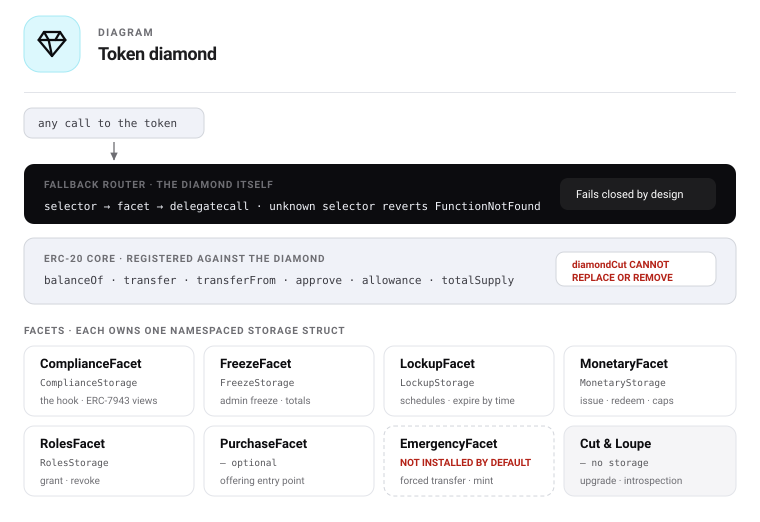

# 03 — Contracts

Every contract and sub-contract in the system.

## Top-level contracts

| Contract | Kind | Instances | Upgradeable | Open source |
|---|---|---|---|---|
| `uRWAToken` | Diamond (EIP-2535) | One per asset | Facets yes; ERC-20 core never | Yes |
| `Treasury` | Minimal clone | One per token | No | Yes |
| `PolicySet` | Standalone | One per token (shareable) | Replaced, not upgraded | Yes |
| `IdentityRegistry` | Adapter | One per chain per tier | Replaced | Yes |
| `OfferingRegistry` | Diamond | One per chain | Yes | Yes |
| `uRWAFactory` | Diamond | One per deployer | Yes | Yes |
| `AssetPassport` | ERC-721 + ERC-5192 | One per chain | Yes | Interface + reference only |
| `AttestorRegistry` | Standalone | One per chain | Yes | Yes |

## Token facets (sub-contracts of `uRWAToken`)

Facets share the token's storage through `delegatecall`. Each owns one namespaced storage struct.

| Facet | Responsibility | Storage owned | In default package |
|---|---|---|---|
| *(diamond core)* | ERC-20 accounting, fallback router, ERC-2612 permit | `CoreStorage` | Always — immutable |
| `DiamondCutFacet` | Add, replace and remove facets; enforces the upgrade delay | `UpgradeStorage` | Yes |
| `DiamondLoupeFacet` | Introspection, ERC-165 | — | Yes |
| `ComplianceFacet` | The transfer hook; ERC-7943 views; trust list; pause | `ComplianceStorage` | Yes |
| `FreezeFacet` | Admin freeze, composed frozen total | `FreezeStorage` | Yes |
| `LockupFacet` | Dated lockup schedules | `LockupStorage` | Yes |
| `MonetaryFacet` | Issue, redeem, distribute, supply caps | `MonetaryStorage` | Yes |
| `RolesFacet` | Role grant and revoke | `RolesStorage` | Yes |
| `PurchaseFacet` | Offering entry point on the token side | — | Optional |
| `EmergencyFacet` | Forced transfer, mint, burn | — | **No — opt-in only** |

`EmergencyFacet` is not installed by default. Installing it is a deliberate act by the issuer,
consistent with how STV3 treats the same functionality.

## Rule contracts (sub-contracts of `PolicySet`)

Stateless, shared across all tokens on a chain, deployed once.

| Rule | Reads | Purpose |
|---|---|---|
| `HasValidIdentity` | `urwa.identity.valid` | Base gate — identity exists, unexpired, unblocked |
| `JurisdictionAllow` | `urwa.jurisdiction.country` | Allow-list of permitted countries |
| `JurisdictionDeny` | `urwa.jurisdiction.country` | Deny-list of excluded countries |
| `USAccreditedOnly` | `us.regd.accredited` | Reg D accreditation with configurable minimum |
| `EUProfessionalOnly` | `eu.mifid2.professional` | MiFID II professional client |
| `EUQualifiedExemption` | `eu.prospectus.qualified` | Prospectus exemption route |
| `MaxHolders` | `subjectHolderCount` | Holder register cap |
| `MaxBalancePerHolder` | `subjectBalance` | Concentration ceiling |
| `HoldPeriod` | lockups | Minimum holding time |
| `TransferWindow` | `block.timestamp` | Blackout periods |
| `SanctionsScreen` | `aml.sanctions.clear` | Screening freshness window |
| `TravelRuleThreshold` | amount, counterparty claim | FATF threshold gate |
| `MiCAIssuerAuthorised` | `mica.issuer.authorised` | Issuer authorised, and still authorised |
| `MiCATokenClass` | `mica.token.class` | Instrument is the declared MiCA class |
| `MiCAWhitepaperNotified` | `mica.whitepaper.notified` | White paper notified before a public offer |
| `MiCAReserveAttested` | `mica.reserve.attested` | Reserve attestation exists and is fresh |

## Identity adapters (sub-contracts implementing `IIdentityRegistry`)

| Adapter | Backed by | Tier | Where used |
|---|---|---|---|
| `AllowlistRegistry` | Own storage | 0 | Open-source default; any fork |
| `EASAdapter` | Ethereum Attestation Service | 1 | Base-native attestations |
| `StoboxDIDAdapter` | StoboxDID | 2 | Stobox instance |

All three expose the identical interface. The token neither knows nor cares which is installed.

## Factory facets (sub-contracts of `uRWAFactory`)

| Facet | Responsibility |
|---|---|
| `DiamondCutFacet` | Upgrade the factory |
| `DiamondLoupeFacet` | Introspection |
| `CreateFacet` | `createToken`, `createTokenWithOffering` |
| `PackageFacet` | Register and query facet packages |
| `PresetFacet` | Register and query policy presets |
| `FeeFacet` | Fee token and amount — zero in the open distribution |
| `RegistryFacet` | Deployment registry, `isStoboxIssued` |

## Offering registry facets

**Not yet split.** The registry ships as one contract. The facet split buys an upgradeable write path
with a stable read path, which is worth having and is not worth having *first*: the money paths need
an audit more than they need upgradeability, and a diamond is a larger surface to audit. Tracked as
`CU-07`, and recorded here rather than left as a silent divergence between this document and the code.

| Facet | Responsibility |
|---|---|
| `OfferingGovernanceFacet` | Create, activate, pause, close, cancel offerings |
| `OfferingStorageFacet` | Reads: offerings, purchases, aggregates |
| `OfferingPurchaseFacet` | Process purchases, allocations, pricing |
| `OfferingRefundFacet` | Operator-push and investor-pull refunds |
| `OfferingRuleFacet` | Attach and detach offering-level rules |

## Dependency rules

1. The token depends on `IPolicySet` and `IIdentityRegistry` **as interfaces only**. Any implementation
   satisfying the interface works.
2. The token does not depend on the passport, the factory or the offering registry. It functions with
   all three absent.
3. Rules depend on `IIdentityRegistry` and on token view functions. They never write.
4. The passport depends on nothing. It is written to, never read from, by the token.
5. No contract in the open distribution references a Stobox address, the STBU token, or any Stobox
   contract. This is an enforced test invariant.

## Related documents

- [04 — Storage](04-storage.md)
- [07 — Function reference](07-functions.md)
- [10 — Rules](10-rules.md)
