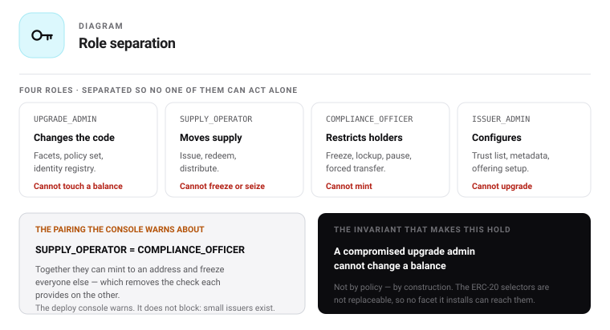

# 05 — Roles and permissions

## Principle

Four separated roles ship as the default. Roles are configurable, which means whatever ships as the
default becomes the de-facto standard. Institutional-grade means separation of duties is the default
and collapsing it is the deliberate opt-out — never the reverse.

## Token roles

```solidity
bytes32 constant UPGRADE_ADMIN      = keccak256("urwa.role.upgrade");
bytes32 constant ISSUER_ADMIN       = keccak256("urwa.role.issuer");
bytes32 constant SUPPLY_OPERATOR    = keccak256("urwa.role.supply");
bytes32 constant COMPLIANCE_OFFICER = keccak256("urwa.role.compliance");
```



### UPGRADE_ADMIN

| | |
|---|---|
| **Held by** | Issuer, or delegated to an operator with the delegation visible on-chain |
| **Recommended** | Multisig, with a timelock on diamond cuts |
| **Granted by** | Itself only — this role administers itself |

**Can:** `diamondCut`, `setPolicySet`, `setIdentityRegistry`, transfer its own role.

**Cannot:** move value, mint, redeem, freeze, seize, or alter any immutable ledger selector.

### ISSUER_ADMIN

| | |
|---|---|
| **Held by** | The issuing company's operational wallet |
| **Granted by** | `UPGRADE_ADMIN` at deploy |

**Can:** grant and revoke `SUPPLY_OPERATOR` and `COMPLIANCE_OFFICER`; `trust` / `distrust`;
`setTreasury`; `setOfferingRegistry`; `setMaxSupply` when the cap is unlocked.

**Cannot:** upgrade, mint, redeem, freeze or seize.

### SUPPLY_OPERATOR

| | |
|---|---|
| **Held by** | Treasury manager, CFO wallet |
| **Granted by** | `ISSUER_ADMIN` |

**Can:** `issue`, `redeem`, `distributeFromTreasury`, `withdrawERC20FromTreasury`.

**Cannot:** freeze, seize, pause, upgrade, or change roles.

### COMPLIANCE_OFFICER

| | |
|---|---|
| **Held by** | Compliance officer or legal team — a dedicated wallet, never a shared operations wallet |
| **Recommended** | Multisig |
| **Granted by** | `ISSUER_ADMIN` |

**Can:** `setFrozenTokens`, `addLockup`, `clearLockups`, `releaseExpired`, `pause`, `unpause`, and —
where `EmergencyFacet` is installed — `forcedTransfer`, `forcedMint`, `forcedBurn`.

**Cannot:** mint through the normal path, upgrade, or change roles.

## Token permission matrix

| Action | UPGRADE | ISSUER | SUPPLY | COMPLIANCE |
|---|:-:|:-:|:-:|:-:|
| `diamondCut` | ✅ | ❌ | ❌ | ❌ |
| `setPolicySet` / `setIdentityRegistry` | ✅ | ❌ | ❌ | ❌ |
| Grant / revoke operational roles | ❌ | ✅ | ❌ | ❌ |
| `trust` / `distrust` | ❌ | ✅ | ❌ | ❌ |
| `setTreasury` / `setOfferingRegistry` | ❌ | ✅ | ❌ | ❌ |
| `setMaxSupply` | ❌ | ✅ | ❌ | ❌ |
| `issue` / `redeem` | ❌ | ❌ | ✅ | ❌ |
| `distributeFromTreasury` | ❌ | ❌ | ✅ | ❌ |
| `setFrozenTokens` | ❌ | ❌ | ❌ | ✅ |
| `addLockup` / `clearLockups` | ❌ | ❌ | ❌ | ✅ |
| `pause` / `unpause` | ❌ | ❌ | ❌ | ✅ |
| `forcedTransfer` / `forcedMint` / `forcedBurn` | ❌ | ❌ | ❌ | ✅ |

## Timelock policy

| Action class | Delay | Reason |
|---|---|---|
| Diamond cuts, policy set swap, identity registry swap | **Timelocked** | Protects holders from a silent change of logic |
| Freeze, lockup, pause, forced operations | **Immediate** | A delay would blunt exactly the emergency response these roles exist for |
| Issue, redeem, distribute | **Immediate** | Ordinary operations |

**The delay is a deployment parameter, chosen by the issuer.** `TokenParams.upgradeDelay` sets it;
`0` means no delay. It applies to the code-changing class only — the immediate class stays immediate
whatever the issuer chose, because a timelock on `pause` would blunt the one response that has to be
instant.

Making it a parameter rather than a fixed policy is deliberate. A regulated fund with a board wants
seven days. A stablecoin issuer patching a live reserve rule cannot wait seven days. Neither is
wrong, and hard-coding either would push the other outside the tool.

**The chosen delay is public.** The verifier displays it, because a token with no timelock and a
token with a seven-day delay are materially different instruments, and a holder should not have to
read storage to find out which one they own.

## Address pause — and how it differs from a freeze

| | Freeze | Address pause |
|---|---|---|
| **Affects** | An amount on one address | One address, entirely |
| **Blocks sending** | ✅ | ✅ |
| **Blocks receiving** | ❌ | ✅ |
| **Partial** | ✅ any amount | ❌ all or nothing |
| **Instrument for** | A compliance decision about a balance | An emergency about a counterparty |

The distinction matters because otherwise the two are the same control wearing different names. A
freeze restricts what a holder may send; it does not stop them being paid. An address pause stops
both directions — the instrument for a compromised wallet or a counterparty under investigation,
where continuing to receive is itself the problem.

Global pause remains separate and remains total: it halts every transfer, trusted addresses included.

## Factory roles

| Role | Can | Cannot |
|---|---|---|
| `FACTORY_ADMIN` | Register packages and presets, set fee token and amount, upgrade the factory | Touch any deployed token |
| *(anyone)* | `createToken`, `createTokenWithOffering` | — |

The factory is permissionless: `createToken` has no access control. `FACTORY_ADMIN` governs only the
factory's own configuration. A deployed token is never controllable by the factory after creation —
which is the point of departure from STV3, where the factory retains `DEFAULT_ADMIN_ROLE`.

## Offering registry roles

| Role | Can |
|---|---|
| `REGISTRY_ADMIN` | Upgrade the registry, set default payment tokens, force offering status |
| `OFFERING_OPERATOR` | Create, activate, pause, close, cancel offerings; process refunds; attach rules |

## Passport roles

| Role | Can |
|---|---|
| `PASSPORT_ADMIN` | Upgrade, manage attestor registry |
| `PASSPORT_ISSUER` | Mint passports, anchor snapshots, confirm token links |
| *(passport owner)* | Grant and revoke access to their own record |
| `ATTESTOR` | Record attestations within their engagement scope |

## StoboxDID roles

Inherited from the existing deployed contract; listed for completeness.

| Role | Can |
|---|---|
| `DEFAULT_ADMIN_ROLE` | Grant and revoke all roles, set max linked addresses |
| `WRITER_ROLE` | Create DIDs, add and update attributes, block and unblock, prolongate, remove linked addresses, deactivate attributes |
| `ATTRIBUTE_READER_ROLE` | `readAttributeList`, `readLinkedAddresses`, `readFullDID` |
| *(DID owner)* | Link addresses, activate and deactivate own addresses, manage own external readers |

Note that `getUserDID`, `getAttribute` and `getLinker` are ungated `view` functions — role gating
applies only to the event-emitting read functions. See [09 — Identity](09-identity-did.md).

## Recommended separation

| Company function | Role |
|---|---|
| Board or CEO, multisig | `UPGRADE_ADMIN` |
| Corporate operations | `ISSUER_ADMIN` |
| CFO or treasury | `SUPPLY_OPERATOR` |
| Legal or compliance, multisig | `COMPLIANCE_OFFICER` |

Avoid one person holding both `SUPPLY_OPERATOR` and `COMPLIANCE_OFFICER` — together they can mint and
then freeze, which removes the check each provides on the other.

## Related documents

- [06 — States](06-states.md)
- [07 — Function reference](07-functions.md)
- [17 — Security](17-security.md)
