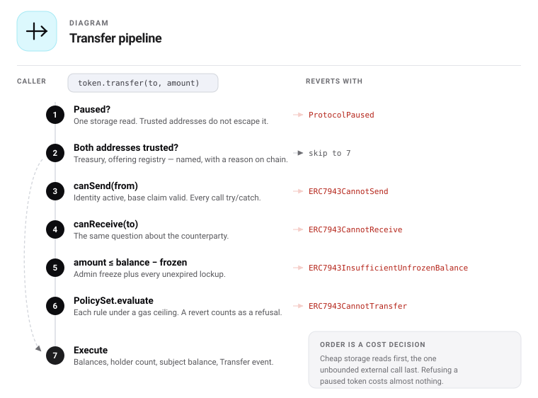

# 08 — Compliance pipeline

## Entry points

Every value movement enters the same hook. There is no path that skips it except the two forced
operations in `EmergencyFacet`, which are separately access-controlled and separately evented.

| Operation | From | To |
|---|---|---|
| `transfer` | holder | holder |
| `transferFrom` | holder | holder |
| `issue` (mint) | `address(0)` | treasury or holder |
| `redeem` (burn) | treasury | `address(0)` |
| `distributeFromTreasury` | treasury | holder |
| `purchase` | treasury | investor |

## The pipeline



```
  transfer · transferFrom · mint · burn
                 │
                 ▼
        ┌────────────────────┐
        │ 1. protocol paused?├──── yes ──▶ revert ProtocolPaused
        └────────┬───────────┘
                 │ no
                 ▼
        ┌────────────────────┐
        │ 2. trusted?        ├── both ──────────────────┐
        └────────┬───────────┘                           │
                 │ no                                    │
                 ▼                                       │
        ┌────────────────────┐                           │
        │ 3. canSend(from)   ├──── no ───▶ ERC7943CannotSend
        └────────┬───────────┘                           │
                 ▼                                       │
        ┌────────────────────┐                           │
        │ 4. canReceive(to)  ├──── no ───▶ ERC7943CannotReceive
        └────────┬───────────┘                           │
                 ▼                                       │
        ┌────────────────────┐                           │
        │ 5. amount ≤ balance├──── no ───▶ ERC7943InsufficientUnfrozenBalance
        │    − frozen        │                           │
        └────────┬───────────┘                           │
                 ▼                                       │
        ┌────────────────────┐                           │
        │ 6. policySet       ├──── no ───▶ ERC7943CannotTransfer
        │    .evaluate()     │                           │
        └────────┬───────────┘                           │
                 │ ◀─────────────────────────────────────┘
                 ▼
        7. execute · update accounting · emit Transfer
```

## Why this order

| Position | Check | Reason |
|---|---|---|
| 1 | Pause | One storage read; overrides everything including trust |
| 2 | Trust | Skips the expensive external call for a trusted party; skips the rules only when both are |
| 3–4 | Identity | An unverified wallet fails regardless of amount, so the cheaper and more informative error comes first |
| 5 | Frozen balance | Local storage beats an external call — never pay for a call a local check would short-circuit |
| 6 | Policy set | The only unbounded-cost step, and the only swappable one |

## Trusted bypass — precise semantics

**Trust exempts a party from its own claim check; it exempts the pair from the rules.**

| | Skipped for a trusted address |
|---|---|
| Its own `canSend` / `canReceive` claim check | ✅ |
| The rule set | Only when **both** parties are trusted |
| Global pause | ❌ never |
| Address pause | ❌ never |
| Its frozen balance | ❌ never |

The asymmetry is deliberate and was found by a test rather than by reasoning. An earlier version
required both parties to be trusted before skipping either claim check — which meant a trusted
treasury could not distribute to a verified investor without itself being registered in the identity
system. That defeats the reason a treasury is trusted at all.

Rules stay pair-wise because a rule about holder counts or concentration is a fact about the
**untrusted** party. Skipping it because their counterparty happens to be a treasury would let the
cap be evaded through any trusted address.


| From | To | Claim checks | Rules |
|---|---|---|---|
| trusted | trusted | both skipped | ❌ skipped |
| trusted | untrusted | sender's skipped | ✅ run |
| untrusted | trusted | recipient's skipped | ✅ run |
| untrusted | untrusted | both run | ✅ run |

## Mint and burn

| Case | `from` | `to` | Checks applied |
|---|---|---|---|
| Mint | `address(0)` | recipient | Pause, `canReceive(to)`, policy set. `canSend` and frozen-balance are skipped — there is no sender. |
| Burn | holder | `address(0)` | Pause, `canSend(from)`, frozen balance, policy set. `canReceive` is skipped. |

ERC-7943 requires that minting in permissioned contexts rejects recipients where `canReceive` would
return false, and that burning respects `canSend`. Both hold here.

## Holder accounting side-effects

Executed atomically in step 7, after all checks pass.

```
if balanceOf(from) becomes 0        → holderCount--
if balanceOf(to) was 0              → holderCount++

subjectBalance[subjectOf(from)] -= amount
subjectBalance[subjectOf(to)]   += amount

if subjectBalance[fromSubject] becomes 0 → subjectHolderCount--
if subjectBalance[toSubject] was 0       → subjectHolderCount++
```

Wallets with no identity subject are assigned a synthetic subject derived from the address, so the
subject count never under-reports.

## Rule evaluation

Inside `policySet.evaluate`:

```
for each group in groups:            // groups AND together
    groupPassed = false
    for each rule in group:          // rules within a group OR
        try rule.check{gas: RULE_GAS_CEILING}(from, to, amount, ctx)
            if ok: groupPassed = true; break
        catch:
            emit RuleFailed(rule, from, to, "reverted or out of gas")
            // counts as reject; continue to next rule in the group
    if not groupPassed:
        return (false, firstFailingRule, reason)
return (true, address(0), "")
```

Three properties fall out:

1. A rule that reverts or runs long counts as **reject**, never as pass.
2. One failing third-party rule cannot brick the token — other rules in the same group can still
   satisfy it.
3. `RuleFailed` is emitted for operational visibility even when the group ultimately passes.

## The diagnostic path

`whyBlocked(from, to, amount)` executes the identical logic in view mode and returns:

| Return | Meaning |
|---|---|
| `stage` | The first failing stage, 1–6; `7` means the transfer would succeed |
| `rule` | The rejecting rule address, or `address(0)` if the failure was not rule-related |
| `reason` | Human-readable string from the rule, or a stage description |

Because enforcement and explanation share one implementation, they cannot drift apart. This is the
mechanism that keeps support cost down — not the diagnostic itself.

## Gas profile — indicative

| Path | Approximate cost |
|---|---|
| Paused revert | ~3k, one storage read |
| Trusted → trusted | ~55k, near plain ERC-20 |
| Untrusted, identity fail | ~15k, fails before the policy call |
| Untrusted, full pipeline, 3 rules | ~110–140k |
| Each additional rule | ~8–15k depending on claim reads |

Figures are design targets for the implementation to measure against, not measurements.

## Related documents

- [06 — States](06-states.md)
- [10 — Rules](10-rules.md)
- [17 — Security](17-security.md)
