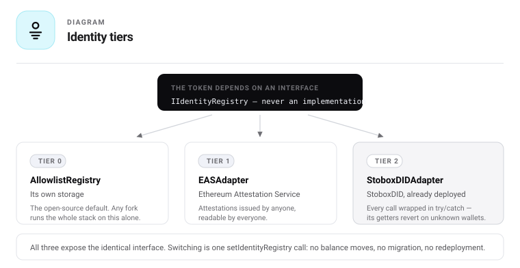
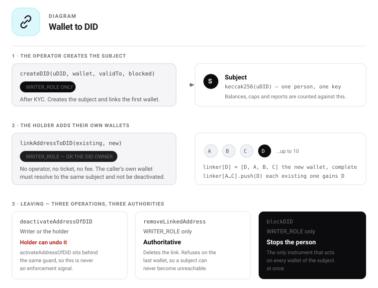
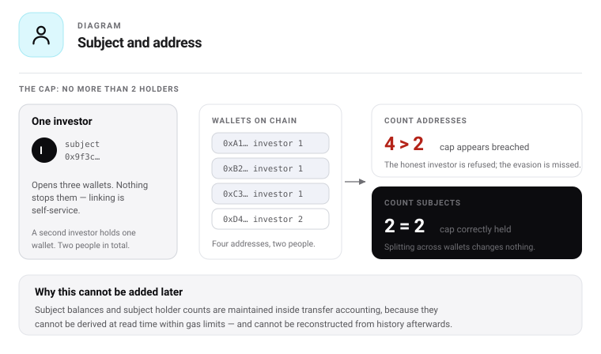

# 09 — Identity and DID

## One interface, three adapters

The token depends on `IIdentityRegistry` as an interface. Any implementation works. This single
indirection is what lets Stobox ship StoboxDID as its own default while the same code, forked, runs
with no Stobox contract in the dependency graph.



```
   ComplianceFacet · PolicySet
              │
              ▼
      IIdentityRegistry
              │
    ┌─────────┼─────────┐
    ▼         ▼         ▼
 Allowlist   EAS    StoboxDID
  tier 0    tier 1   tier 2
```

| Tier | Adapter | Holds | Ships in |
|---|---|---|---|
| **0** | `AllowlistRegistry` | address → permitted | Open-source default; any fork |
| **1** | `EASAdapter` | Namespaced claims with issuer, expiry, revocation | Open source; Base-native |
| **2** | `StoboxDIDAdapter` | Claims + subject binding + jurisdiction rules linked on-chain | Open source; StoboxDID itself is Stobox-operated |

## Why extended, not a plain whitelist

A plain allowlist answers exactly one question — is this address permitted. It cannot supply
jurisdiction, accreditation, professional-client status or investor type. Those facts would remain
manually maintained forever, and the rules that depend on them could not exist.

The tier therefore determines how much of the compliance configuration can ever be machine-verified.
Tier 0 exists so a fork works at all, not because it is sufficient for a regulated issuance.

## The interface

```solidity
struct Claim {
    bytes32 valueHash;    // hashed value — no personal data on chain
    uint256 numeric;      // optional bound, for thresholds and tiers
    uint64  issuedAt;
    uint64  expiresAt;    // 0 = no expiry
    address issuer;       // attesting authority
    bool    revoked;
}

interface IIdentityRegistry {
    function subjectOf(address wallet) external view returns (bytes32 subject);
    function isActive(address wallet) external view returns (bool);
    function claim(bytes32 subject, bytes32 key) external view returns (Claim memory);
    function hasValidClaim(bytes32 subject, bytes32 key) external view returns (bool);
}
```

## Claim keys

Keys are `keccak256` of a dotted namespace. Stobox owns `urwa.*`. Anyone may define their own —
`ch.finma.qualified` needs no permission from Stobox and no core upgrade. **This is the extensibility
guarantee**, and it is why the schema is a key-value registry rather than a fixed struct.

The **base identity gate** — the sender-verified and recipient-verified checks every transfer passes —
is `isActive(wallet)`, not a subject-keyed claim read. Across all three tiers `isActive` is the
authoritative answer: the allowlist's permission, EAS's identity attestation (whose `isActive` *is*
its `hasValidClaim(subject, urwa.identity.valid)`), and StoboxDID's live, unblocked, unexpired DID.
This matters because StoboxDID is **wallet-keyed** and cannot be read by subject on chain, so a base
gate that required a subject-keyed `hasValidClaim(urwa.identity.valid)` refused every tier-2 transfer.
The subject-keyed claim reads below are for the **rules**, which read the other keys.

| Key | Carries | Used by |
|---|---|---|
| `urwa.identity.valid` | Existence, expiry, block status | The base gate, via `isActive`; a preset may also add the `HasValidIdentity` rule |
| `urwa.jurisdiction.country` | Hashed ISO 3166-1 alpha-2 | `JurisdictionAllow` / `JurisdictionDeny` |
| `urwa.investor.type` | Retail, professional, institutional | Reporting only — no rule in the default library reads it |
| `us.regd.accredited` | US accredited-investor status + expiry | `USAccreditedOnly` |
| `eu.mifid2.professional` | MiFID II professional client + expiry | `EUProfessionalOnly` |
| `eu.prospectus.qualified` | Qualified-investor status | `EUQualifiedExemption` |
| `aml.sanctions.clear` | Screening result + timestamp | `SanctionsScreen` |
| `iso17442.lei` | Hashed Legal Entity Identifier | Reporting only — no rule in the default library reads it |
| `mica.issuer.authorised` | Authorisation status + competent authority + expiry | `MiCAIssuerAuthorised` |
| `mica.token.class` | ART, EMT or other crypto-asset | `MiCATokenClass` |
| `mica.whitepaper.notified` | Notification date to the competent authority | `MiCAWhitepaperNotified` |
| `mica.reserve.attested` | Reserve attestation date + attestor | `MiCAReserveAttested` |

### The MiCA keys, and what they are for

Four keys were added for the tokens that genuinely fall under MiCA — asset-referenced tokens and
e-money tokens — because those obligations attach to the **issuer and the instrument**, not to the
holder. That is the opposite of every other key here, and it is why they could not be folded into the
existing set.

| Key | Attaches to | Why a rule needs it |
|---|---|---|
| `mica.issuer.authorised` | The issuer | An unauthorised issuer may not offer the token at all |
| `mica.token.class` | The instrument | Determines which obligations apply; ART and EMT differ |
| `mica.whitepaper.notified` | The instrument | A public offer without notification is not permitted |
| `mica.reserve.attested` | The instrument | ART and EMT must be backed; staleness is the risk |

`mica.reserve.attested` is the one that ties the two halves of this system together. The claim carries
a date and an attestor; the evidence behind it lives in the [Asset Passport](11-passport.md) as a
committed datapoint. **The chain enforces that an attestation exists and is fresh. It never sees what
the attestation says.**

Two keys are marked **reporting only**. They are declared because issuers and supervisors ask for
them and because a fork may write rules against them, but no rule in the default library reads either
one. The distinction is recorded rather than hidden: a key that looks enforced but is not is worse
than a key that is plainly informational, and `L2.12` fails if any other key lacks a consumer.

### EU and US eligibility are separate keys, deliberately

EU **professional client** and US **accredited investor** are different tests with different
thresholds. Collapsing them into one `accredited` boolean makes it impossible to run a Reg S tranche
and an EU tranche off one identity set. This is the schema decision that would be most expensive to
reverse.

## StoboxDID mapping — no fork required

StoboxDID already provides everything tier 2 requires.

| `IIdentityRegistry` | StoboxDID source |
|---|---|
| `subjectOf(wallet)` | `getLinker(wallet).uDID`, hashed to `bytes32` |
| `isActive(wallet)` | `!linker.deactivated` AND `!did.blocked` AND `did.validTo > now` |
| `claim(subject, key)` | `getAttribute(wallet, keyString)` → value, validTo, lastUpdatedBy |
| `hasValidClaim` | attribute exists AND `validTo > now` AND not deactivated |

Existing structures used:

```solidity
struct Attribute {
    bytes value; string valueType;
    uint256 createdAt; uint256 updatedAt; uint256 validTo;
    address lastUpdatedBy;
}

struct Linker {
    string UDID; uint256 joinDate; uint256 updateDate;
    bool deactivated; address[] linkedAddresses;
}
```

`Linker` gives wallet → subject, which is exactly the subject binding holder caps require.

Source: [StoboxTechnologies/Stobox-Decentralized-ID](https://github.com/StoboxTechnologies/Stobox-Decentralized-ID),
MIT. Deployed on Arbitrum One at `0x25E6036178656b1329ee51696407b367D8C6ba84` and on Arbitrum Sepolia
at `0xA832662d1E11F2a6cEF706cE54A993E7eeEDC440`. No audit is published.

## How a wallet is linked to a DID

The mechanism the whole subject-based accounting rests on, stated exactly as the deployed contract
implements it.



### Two ways in, with different authority

| | `createDID(uDID, wallet, validTo, blocked)` | `linkAddressToDID(existingWallet, newWallet)` |
|---|---|---|
| **Who may call** | `WRITER_ROLE` only | `WRITER_ROLE` **or the DID owner** |
| **Creates the subject** | Yes | No — the subject must exist |
| **Wallets after** | Exactly one | One more, up to the cap |
| **Typical caller** | The onboarding operator, after KYC | **The holder, from their own wallet** |

The second row is the one that matters and the one most integrations get wrong. `linkAddressToDID`
is guarded by `writerOrDIDOwner`, which passes when the caller's own wallet resolves to the **same
UDID** and that wallet is not deactivated. **A verified holder adds their own further wallets without
asking anyone** — no operator, no ticket, no fee.

### Preconditions, each with its own error

| Condition | Reverts with |
|---|---|
| The reference wallet has a DID | `AddressDoesNotLinkedToDID` |
| The new wallet is not `address(0)` | `ZeroAddressNotAllowed` |
| The new wallet is not already linked anywhere | `AddressAlreadyLinkedToDID(addr, uDID)` |
| Caller is a writer, or owns the DID and is not deactivated | `NotAuthorizedForThisTransaction` |
| The subject is below the wallet cap | `MaxLinkedAddressesExceeded(uDID, max)` |

A wallet belongs to **at most one** subject, enforced at link time rather than reconciled later.
This is what makes `subjectOf` a total function and what makes holder caps sound.

### What the link writes

Every wallet of a subject stores the **full list** of that subject's wallets, so linking writes to all
of them:

```
linkAddressToDID(A, D)  where A already has {A, B, C}

  linker[D].linkedAddresses = [D, A, B, C]     the new wallet, complete
  linker[A].linkedAddresses.push(D)            each existing wallet, appended
  linker[B].linkedAddresses.push(D)
  linker[C].linkedAddresses.push(D)
```

Cost grows with the number of wallets already linked — the nth link writes n entries. Bounded by
`MAX_DID_LINKED_ADDRESSES`, **10 by default**, changeable by `DEFAULT_ADMIN_ROLE` through
`setMaxDIDLinkedAddresses`. At ten the worst case is trivial; the design would not survive a cap of
several hundred, which is a reason not to raise it casually.

### Leaving: three different things, three different authorities

**This is the distinction that determines what a compliance officer may rely on.**

| Operation | Who may call | Reversible by the holder | Effect |
|---|---|---|---|
| `deactivateAddressOfDID(wallet)` | Writer **or the DID owner** | **Yes — `activateAddressOfDID`** | That wallet stops resolving as active |
| `removeLinkedAddress(wallet)` | `WRITER_ROLE` only | No | The link is deleted; refuses on the last wallet |
| `blockDID(uDID, reason)` | `WRITER_ROLE` only | No — needs `unBlockDID` | **Every** wallet of the subject fails at once |

**Wallet deactivation is not a compliance control.** The holder can call `activateAddressOfDID` and
undo it in the next block, because both sit behind the same `writerOrDIDOwner` guard. It is a
self-service convenience — losing a device, retiring a hot wallet — and reading it as an enforcement
signal would be a serious error.

Only `blockDID` and `removeLinkedAddress` are authoritative, and only `blockDID` acts on the whole
subject. A rule that must stop a person, rather than an address, has exactly one instrument.

`removeLinkedAddress` also refuses to remove the last wallet (`CantRemoveLastLinkedAddress`), so a
subject can never become unreachable. Where its internal bookkeeping disagrees with itself it emits
`UnexpectedBehavior` and continues rather than reverting — worth indexing, because it is the contract
reporting its own inconsistency.

### What this means for the factory

| Fact | Consequence for us |
|---|---|
| Holders link their own wallets | The issuer does not control the wallet set. Caps must count subjects, or they count nothing. |
| Deactivation is holder-reversible | `isActive` may read it, but no rule may treat it as enforcement. Enforcement reads `blocked`. |
| Cap is 10 and admin-mutable | Read `MAX_DID_LINKED_ADDRESSES` rather than assuming it; a raise changes gas, not correctness. |
| `readLinkedAddresses` emits an event | It is **not** a `view` function and cannot be called from the compliance path. |
| UDID is a `string` | The subject is `keccak256(bytes(uDID))`. Fixed once; changing it re-keys every balance. |

The fourth row is the reason the adapter never enumerates wallets. It derives the subject from
`getLinker(wallet).uDID` and hashes it — one read, no list, and it works from a `view` context, which
enumeration cannot.

## Swapping the registry

`setIdentityRegistry` replaces the claims source. **No balance moves and no holder loses anything.**

| | |
|---|---|
| Existing balances | Untouched |
| Existing holders | Re-checked at their next transfer, not retroactively |
| A holder who fails the new registry | Keeps their tokens; cannot transfer until they are registered |
| Trusted addresses | Unaffected — they skip claims entirely |

This is the only defensible behaviour. Retro-checking would mean either seizing from holders who did
nothing wrong, or maintaining a second eligibility state that drifts from the first. Deferring to the
next transfer keeps one source of truth and puts the cost on the person who has to act.

The transition is therefore visible rather than silent: a holder discovers the change when
`canTransfer` returns false, and `whyBlocked` names the missing claim. The console warns the issuer
that a swap will strand any holder not present in the new registry, with the count, before it runs.

## Blocking integration defect — must be handled in the adapter

`getUserDID` and `getAttribute` carry the `hasDID` modifier and **revert** when the wallet has no DID.

ERC-7943 requires that `canSend`, `canReceive` and `canTransfer` **never revert**. An unknown wallet —
the single most common case in any transfer to a new counterparty — would therefore break conformance.

**Every StoboxDID call in the adapter must be wrapped in `try/catch`**, returning "no claim" rather
than bubbling the revert:

```solidity
function isActive(address wallet) external view returns (bool) {
    try did.getLinker(wallet) returns (string memory u, uint256, uint256, bool deactivated) {
        if (deactivated) return false;
        try did.getUserDID(wallet) returns (string memory, uint256 validTo, uint256, bool blocked, address) {
            return !blocked && validTo > block.timestamp;
        } catch { return false; }
    } catch { return false; }
}
```

Check `getLinker` first — it reverts only on a missing linker — and treat any failure as absence.
This pattern applies to every read in the adapter without exception.

`isActive` reads `deactivated` because a holder who disabled a wallet should not transact from it.
**No rule may read it as an enforcement signal**, for the reason given above: the holder can reverse
it themselves. Rules that must stop a person read `blocked`.

## Privacy check before launch

`getUserDID`, `getAttribute` and `getLinker` are `public view` with **no role gate**. Only the
event-emitting `readAttributeList`, `readLinkedAddresses` and `readFullDID` are gated by
`ATTRIBUTE_READER_ROLE`.

Attribute values are therefore world-readable on chain today. That is correct and necessary — the
compliance pipeline must read them from a `view` context — but it means **values must be hashes, never
plaintext**.

**Action:** confirm that no deployment stores plaintext country codes, names or document numbers in
`Attribute.value`, and make hashing the documented convention for every writer.

## Wallets and subjects



| Fact | Consequence |
|---|---|
| One subject may hold many wallets | Holder caps must count subjects |
| The holder links their own wallets | The wallet set is outside the issuer's control; only the subject count is enforceable |
| A wallet may be deactivated without blocking the subject | Other wallets of the same subject keep working |
| Deactivation is reversible by the holder | Never an enforcement signal — see the authority table above |
| A wallet with no subject | Assigned a synthetic subject derived from the address, so counts never under-report |
| Maximum wallets per DID | Enforced by StoboxDID via `MAX_DID_LINKED_ADDRESSES`, 10 by default |

## Revocation

| Mechanism | Scope | Effect |
|---|---|---|
| `blockDID` | Whole subject | Every wallet fails `isActive` immediately |
| `deactivateDIDAttribute` | One claim | That claim fails `hasValidClaim`; others unaffected |
| `deactivateAddressOfDID` | One wallet | That wallet fails; subject and other wallets unaffected. **Holder-reversible — not enforcement** |
| `removeLinkedAddress` | One wallet | The link is deleted. `WRITER_ROLE` only; refuses on the last wallet |
| Attribute `validTo` elapses | One claim | Automatic, no transaction |

Revocation takes effect on the **next transfer**, not on the next onboarding cycle. There is no cache.

## Related documents

- [10 — Rules](10-rules.md)
- [06 — States](06-states.md#5-identity-subject-state)
- [11 — Asset Passport](11-passport.md)
