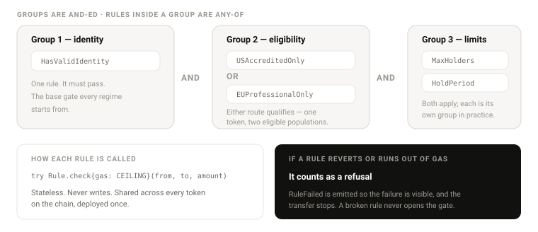

# 10 — Rules

## Composition

Rules are organised into groups. **Groups AND together; rules within a group OR.**



```
( HasValidIdentity )
AND ( EUProfessionalOnly OR USAccreditedOnly )
AND ( SanctionsScreen )
AND ( MaxHolders )
```

This covers every real jurisdictional case — "professional in the EU or accredited in the US" is the
canonical one — without a general boolean engine. A full expression engine with arbitrary nesting and
negation was considered and rejected: it is the easiest place in the system to misconfigure a live
compliance policy and the hardest thing to audit, and no real requirement has needed it.

## The rule contract

```solidity
struct Context {
    address token;
    bytes32 fromSubject;
    bytes32 toSubject;
    uint256 subjectHolderCount;
}

interface IRule {
    function check(address from, address to, uint256 amount, Context calldata ctx)
        external view returns (bool ok, string memory reason);
    function bounds(address account) external view returns (uint256 min, uint256 max);
    function ruleId() external view returns (bytes32);
}
```

Rules are **pure predicates**. They never write state. Where a rule appears to need state — a holder
cap — the token maintains the counter in its transfer accounting and the rule reads it through
`Context`. This keeps every rule replaceable without a data migration.

`bounds` lets a rule report a minimum and maximum investment for an account without mutating anything;
the offering registry applies it. This is how accreditation-linked minimums work.

## Rule library

Stateless, deployed once per chain, shared by every token.

### HasValidIdentity

| | |
|---|---|
| **Reads** | `urwa.identity.valid` |
| **Passes when** | Claim exists, unexpired, not revoked, and `isActive(wallet)` |
| **Reason on failure** | `"no valid identity"` |
| **Applied to** | Both parties |

The default token-level rule. Every preset includes it.

### JurisdictionAllow / JurisdictionDeny

| | |
|---|---|
| **Reads** | `urwa.jurisdiction.country` |
| **Config** | Set of hashed ISO 3166-1 alpha-2 codes |
| **Passes when** | Allow: country ∈ set. Deny: country ∉ set. |
| **Reason** | `"jurisdiction not permitted"` / `"jurisdiction excluded"` |

Countries are compared as hashes, so no plaintext country code appears in calldata.

### USAccreditedOnly

| | |
|---|---|
| **Reads** | `us.regd.accredited` |
| **Config** | Minimum investment amount |
| **Passes when** | Claim valid and unexpired |
| **`bounds`** | Returns the configured minimum |
| **Reason** | `"not an accredited investor"` |

### EUProfessionalOnly

| | |
|---|---|
| **Reads** | `eu.mifid2.professional` |
| **Passes when** | Claim valid and unexpired |
| **Reason** | `"not a professional client"` |

### EUQualifiedExemption

| | |
|---|---|
| **Reads** | `eu.prospectus.qualified` |
| **Passes when** | Claim valid, used for the prospectus-exemption route |
| **Reason** | `"not a qualified investor"` |

### MaxHolders

| | |
|---|---|
| **Reads** | `ctx.subjectHolderCount` |
| **Config** | Cap, e.g. 2000 for Reg D |
| **Passes when** | Recipient already holds, or `subjectHolderCount < cap` |
| **Reason** | `"holder limit reached"` |

**Counts subjects, not addresses.** An address-based cap is defeated by one investor using several
wallets.

### MaxBalancePerHolder

| | |
|---|---|
| **Reads** | `subjectBalanceOf(ctx.toSubject)`, `totalSupply` |
| **Config** | Absolute amount or basis points of supply |
| **Passes when** | Post-transfer subject balance ≤ cap |
| **Reason** | `"concentration limit exceeded"` |

### HoldPeriod

| | |
|---|---|
| **Reads** | Lockups on the sender |
| **Config** | Minimum holding duration |
| **Passes when** | The amount is outside any active lockup |
| **Reason** | `"hold period not elapsed"` |

Enforced through the frozen total rather than as a separate check, so it composes correctly with
admin freezes.

### TransferWindow

| | |
|---|---|
| **Reads** | `block.timestamp` |
| **Config** | Blackout intervals |
| **Passes when** | Now is outside every blackout |
| **Reason** | `"transfers closed during this window"` |

For record dates, distributions and corporate actions.

### SanctionsScreen

| | |
|---|---|
| **Reads** | `aml.sanctions.clear` |
| **Config** | Freshness window, e.g. 30 days |
| **Passes when** | Claim exists, is clear, and `issuedAt` is within the window |
| **Reason** | `"sanctions screening stale or failed"` |

Freshness is enforced by the rule, not the registry — so different tokens can demand different
cadences from the same claim.

### TravelRuleThreshold

| | |
|---|---|
| **Reads** | Amount, counterparty claim presence |
| **Config** | Threshold amount |
| **Passes when** | Below threshold, or counterparty data present |
| **Reason** | `"counterparty data required above threshold"` |

### MiCA rules — the four that read the instrument, not the holder

| Rule | Reads | Passes when |
|---|---|---|
| `MiCAIssuerAuthorised` | `mica.issuer.authorised` | Authorisation exists, names a competent authority, unexpired |
| `MiCATokenClass` | `mica.token.class` | The class matches what the token was configured as |
| `MiCAWhitepaperNotified` | `mica.whitepaper.notified` | A notification date exists and precedes the offer |
| `MiCAReserveAttested` | `mica.reserve.attested` | An attestation exists and is inside its freshness window |

These four are structurally different from every other rule in the library: they read facts about the
**issuer and the instrument**, not about the person transferring. The subject they query is the
issuer's, fixed at deployment, so the answer is identical for every holder.

That has a consequence worth stating. A stale reserve attestation blocks **every** transfer of the
token at once, not one holder's. This is the intended behaviour for a backed instrument — a
stablecoin whose reserve has not been attested for six months should stop moving — but an issuer who
does not expect it will experience it as a total outage. The console warns at configuration time.

## Presets

Named, audited compositions selected at deployment and extendable afterwards. Configurability without
defaults is a trap: issuers misconfigure compliance and blame the tool.

**Three presets ship, plus the open one.**

| Preset | Composition |
|---|---|
| `RegD506c` | identity AND us.accredited AND sanctions AND MaxHolders(2000) AND HoldPeriod |
| `RegS` | identity AND JurisdictionDeny(US) AND sanctions AND HoldPeriod |
| `MiCA-ART` | identity AND sanctions AND `MiCAIssuerAuthorised` AND `MiCATokenClass` AND `MiCAWhitepaperNotified` AND `MiCAReserveAttested` |
| `MiCA-EMT` | identity AND sanctions AND `MiCAIssuerAuthorised` AND `MiCATokenClass` AND `MiCAWhitepaperNotified` AND `MiCAReserveAttested` |
| `Open` | identity AND sanctions |

MiCA presets exist because commodity-backed tokens and stablecoins fall under MiCA rather than under
securities law. See [15 — Standards](15-standards.md#regulatory-regimes).

### No EU securities preset, deliberately

There is **no MiFID II preset**. EU security-token issuance is a later phase, and shipping a preset
for a regime nobody has yet run an issuance under would be a claim rather than a tool.

What exists is the capability, not the shortcut. `EUProfessionalOnly` and `EUQualifiedExemption` are
in the rule library, `eu.mifid2.professional` and `eu.prospectus.qualified` are in the claim schema,
and an EU issuer can compose them by hand today. Only the one-click regime is absent.

Stated plainly because the omission looks like a gap and is not one: **MiCA does not cover security
tokens.** An EU equity or debt token is a MiFID II instrument, and choosing a MiCA preset for it
would be wrong in a way the tool cannot detect.

## Failure handling

Each rule runs inside `try/catch` under a gas ceiling of **100,000 gas**.

The ceiling is a **constant in the code, identical for every token**, not a per-policy setting. A
configurable ceiling is worse than a fixed one: set too low it turns a working rule into a silent
refusal, and the failure looks like a compliance decision rather than a misconfiguration. One hundred
thousand is enough for an external claim read plus arithmetic, and with the rule count capped the
worst case stays well inside a block.

| Condition | Result |
|---|---|
| Rule returns `ok = true` | Group satisfied |
| Rule returns `ok = false` | Try the next rule in the group |
| Rule reverts | Counts as **reject**; `RuleFailed` emitted |
| Rule exceeds the gas ceiling | Counts as **reject**; `RuleFailed` emitted |
| No rule in a group passes | Whole evaluation fails with that group's first reason |

`ruleCount` is hard-capped at `maxRules` so an admin cannot gas-grief the token into unusability. If
the entire policy set is broken, the compliance officer swaps it in one transaction — fail-closed
without a recovery path would itself be a bug.

## Writing a third-party rule

1. Implement `IRule`. Keep `check` pure and cheap — it runs on every transfer.
2. Read only from `IIdentityRegistry`, token view functions and `Context`.
3. Return a short, specific `reason`. It surfaces directly in `whyBlocked`.
4. Never revert for an ordinary "no" — return `(false, reason)`. Reverting works, but produces a worse
   diagnostic and consumes the gas ceiling.
5. Deploy once; the rule is stateless and shareable across tokens.

No permission from Stobox is required at any step. A new claim key and a new rule together add a new
jurisdiction to the system without touching any core contract.

## Related documents

- [08 — Compliance pipeline](08-compliance-pipeline.md)
- [09 — Identity and DID](09-identity-did.md)
- [12 — Offerings](12-offering.md)
