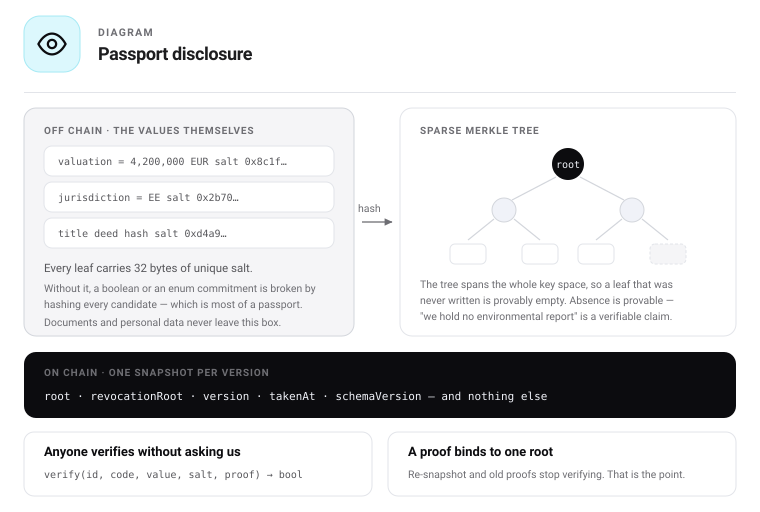

# 11 — Asset Passport

The passport is where the token stops being a number and starts being an asset. It is also the one
component that stays proprietary. The architecture keeps the token fully open and fully functional
without a passport, while making the **verified link** something only the passport operator can grant.

## The handshake

```
   uRWAToken                         AssetPassport
   (open source)                     (proprietary)
        │                                  │
        │────── declareToken() ───────────▶│      anyone can declare
        │                                  │
        │◀───── confirmToken() ────────────│      only the passport confirms
        │                                  │
        └──── link valid only if both sides agree ────┘
```

| Approach | Verdict |
|---|---|
| Link stored on the token only | **Insufficient.** Discoverable, but the issuer controls the token, so any token could claim any asset's passport. No forgery resistance. |
| Link stored on the passport only | **Insufficient.** The operator controls the truth, but an integrator reading the token cannot find the passport. |
| **Bidirectional handshake** | **Correct.** Discoverable from the token, forgery-resistant, and the confirming side is the one Stobox owns. |

One passport may confirm **many** tokens — an asset tokenized in equity and debt tranches, or a second
series on another chain. Each link is confirmed independently.

## The passport is descriptive, never dispositive

A hard dependency — no valid passport, no transfers — must be refused, for two reasons that follow
from decisions already made.

1. **It would kill the open-source claim.** A fork with no passport would be a crippled token, and the
   credibility test fails.
2. **It would violate the resilience guarantee.** Compliance is safety-critical; the passport is an
   information service. Putting a commercial system on the critical path of a regulated one is the
   wrong dependency direction.

Where an issuer genuinely wants passport state to gate transfers — a revoked passport freezing the
asset — that is an ordinary, opt-in `PassportValidRule` in the policy plane. The architecture already
has the right home for it, so no new mechanism is needed and the dependency remains the issuer's
deliberate choice.

## What crosses onto the chain

**Commitments and signatures, never content.** One 32-byte snapshot root anchors the entire record.



```
   private record            salted leaves           sparse Merkle tree
   899 datapoints    ──▶   hash(code ‖ value ‖  ──▶   absence provable
                            salt ‖ attestor ‖               │
                            issuedAt ‖ validUntil)          │
  ═══════════════════════════════════════════════════════   │
   values, documents and personal data never cross          │
  ═══════════════════════════════════════════════════════   ▼
   ON-CHAIN:  snapshotRoot · revocationRoot · attestation metadata
              passportId · chainId · token links — no values, ever
```

```solidity
leaf = keccak256(registryCode ‖ valueBytes ‖ salt ‖ attestorId ‖ issuedAt ‖ validUntil);
// salt: 32 random bytes, unique per (datapoint, version)
```

### Why each element is required

| Element | Without it |
|---|---|
| **Per-leaf salt** | A commitment to a country code, boolean or enum is broken by hashing every candidate. Most of the registry is enums and booleans. |
| **Sparse tree** | Absence is unprovable, so an issuer simply omits the inconvenient fact and you cannot distinguish "missing" from "not disclosed". |
| **`validUntil` in the leaf** | A two-year-old valuation renders identically to yesterday's. |
| **Separate `revocationRoot`** | A withdrawn audit opinion still verifies against the old root forever. |
| **`schemaVersion`** | Leaves cannot be interpreted after the registry evolves. |

## Snapshot cadence

Not every edit is anchored — that is expensive, noisy, and leaks the rhythm of the issuer's internal
work. Four triggers:

| Trigger | Purpose |
|---|---|
| **Creation** | Opening state, before any token exists |
| **Tokenization** | The snapshot the handshake binds to |
| **Material event** | New valuation, audit, proof-of-reserves, regime change, red-flag change |
| **Freshness expiry** | A group's window elapses, so staleness is provable rather than assumed |

Between snapshots the off-chain record is live but unprovable. That is the correct trade: a proof
against a two-week-old root with a visible timestamp is honest; a continuously rewritten root would be
both costly and impossible to cite.

### Freshness is per group, not per passport

A single cadence for the whole record is wrong in both directions: it re-anchors a valuation that has
not moved, and lets a sanctions screen go stale for a month.

| Group | Window | Why |
|---|---|---|
| Sanctions and screening | Days | The fact it asserts changes without warning |
| Reserve attestation | Days to weeks | What `MiCAReserveAttested` enforces; the basis of a backed token |
| Valuation | Up to a year | Moves slowly, and re-valuing costs real money |
| Legal opinion, title, custody | Until superseded | Changes on an event, never on a clock |
| Identity of the asset — class, jurisdiction | No window | Does not change; if it does, the passport is wrong |

**Staleness is a readable fact, not a hidden one.** A group past its window is visibly stale to
anyone checking, which is the difference between "nothing has changed" and "nobody has looked in
three years" — the distinction a cadence-only design cannot express.

## Visibility — nothing is disclosed by default

**The passport publishes no values.** Every datapoint is a commitment; reading one requires an
explicit, expiring grant. There is no tier that is open to the world.

| Disclosure tier | On chain | Who reads the value |
|---|---|---|
| **Granted** | commitment | A named grantee, off chain, verified against the root |
| **Regulator tier** | commitment | A supervisor under legal basis, logged |

Both sit in the same Merkle tree, so the snapshot root covers the complete record. Only the path from
commitment to value differs, and neither path is open.

### Then why does a token look transparent?

Because most of what an investor needs is **not passport data at all**. Asset class, jurisdiction,
regime, supply, holder distribution, the live rule set, the token's own address and standard — all of
that is token state, readable directly from the chain by anyone, with no passport involved and no
grant required.

That separation is the point. The chain carries what the instrument *is*; the passport carries
evidence about the asset behind it. Confusing the two is what produces systems where an investor must
ask permission to learn the transfer rules they are already bound by.

### Attestation metadata is public even when the value is not

A counterparty can see that a named audit firm signed the reserve figure eleven days ago, under an
attestation valid for ninety days — without seeing the figure.

That is enormous signal at zero disclosure, and it answers most of the diligence question before
anyone signs an NDA. It is also what `MiCAReserveAttested` reads: the rule needs to know an
attestation exists and is fresh, never what it says.

### What the issuer gives up by disclosing nothing

Stated because the decision has a cost. An asset whose datapoints are all behind grants is harder to
assess casually, and some investors will not ask. The issuer trades reach for control.

The default is closed because the reverse mistake is unrecoverable: a value published once cannot be
unpublished, and much of a real asset record is commercially sensitive or personal. An issuer who
wants openness grants broadly — including a grant to everyone, if they choose. **Opening is a
decision; leaking is an accident.**

## No personal data. None.

Not in clear, and **not hashed either**. A hash of a passport number or a name is still personal data —
it is a pseudonym, re-identifiable by anyone who can guess the input. Anchoring it makes an erasure
request impossible to honour, permanently.

The architecture removes the problem rather than managing it: person-level facts live in the DID
claims plane, keyed to a subject, and never enter the asset passport tree. The asset passport is about
the asset. Where a person is unavoidably involved — a UBO, a named principal — the passport holds a
**reference to a claim held elsewhere**, never the person's data.

## Access grants

```solidity
struct AccessGrant {
    address   grantee;
    bytes32[] groups;      // registry group codes, not individual datapoints
    uint64    expiresAt;   // always expires — not optional in the type
    bytes32   termsHash;   // NDA or engagement letter
    bool      revoked;
}
```

The **grant** is on chain and auditable; the **data** is not. This inverts the usual mistake, where
the data is visible and the permissions are private.

Grants are made at **group** level. 109 registry groups is a workable permission surface; 899
individual toggles is one nobody would use correctly, and a permission model too fine to operate gets
set to "all".

## Data points are attestations, not passport storage

If Stobox is the only writer, every data point carries exactly one signature: ours. If data points are
attestations, an independent valuer signs their own valuation and an auditor signs their own audit.

**An independent appraiser's signed attestation is worth more to an institutional buyer than the same
number asserted by the tokenization vendor.** Opening the write path makes the passport more valuable,
not less. Stobox's position is curation — which attestors are recognised, what the schemas mean, and
the intelligence layer on top. That is a moat made of data and judgement, which cannot be forked.

## Reads are free and ungated

An exchange, custodian or lender that cannot independently verify a passport will not rely on it, and
a passport nobody relies on has nothing to sell. **Gate the pen, never the window.**

## What is open and what is not

| Open — MIT | Proprietary |
|---|---|
| `IAssetPassport` interface | Stobox Passport implementation |
| Handshake link contract | Data-point schemas and intelligence layer |
| `PassportValidRule` (optional) | Recognised attestor set and curation |
| Reference passport — full mechanics, no intelligence | Compass console and pipelines |
| Snapshot format, proof format, verifier library | |

The open reference passport must be complete enough that a fork genuinely works. Someone could build a
competing intelligence layer on the interface — that is the correct trade. Forkable code is never a
moat; the data pipeline and the attestor relationships are.

## Related documents

- [06 — States](06-states.md#9-passport-state)
- [07 — Function reference](07-functions.md#assetpassport)
- [17 — Security](17-security.md)
