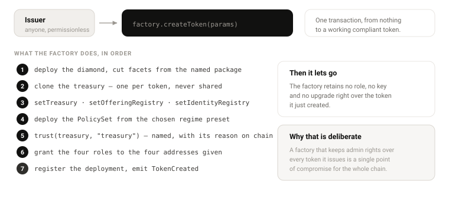

# 16 — Deployment

## Chain

| | |
|---|---|
| **Primary** | Base |
| **Testnet** | Base Sepolia |
| **Secondary** | Arbitrum One — existing STV3 deployments and the current StoboxDID |
| **Cross-chain** | Seam retained (CCT-compatible mint/burn) but not wired in v1 |

Base is primary because the settlement currency and the attestation infrastructure live there, and
because EAS is Base-native, so tier 1 works with nothing deployed by us.

### StoboxDID moves to Base

Tier 2 was unreachable on Base: [StoboxDID](09-identity-did.md) is deployed on Arbitrum One, and an
adapter cannot read across chains. **A fresh StoboxDID is deployed on Base.**

| Decision | Consequence |
|---|---|
| Clean deployment, not a bulk migration | No personal attribute is copied between chains without the subject being re-onboarded |
| Subjects re-created on first need | An issuer's first Base issuance drives onboarding; nothing is created speculatively |
| The UDID string is preserved | `keccak256(uDID)` is unchanged, so **a subject keeps the same identity on both chains** with no bridge and no oracle |

The last row is what makes this cheap. Subject identity is derived from the DID string, not from a
contract address or a chain id, so the same person hashes to the same `bytes32` wherever they are
registered. Holder caps, reports and balances line up across chains without anything being trusted to
carry state between them.

**What does not carry across is authority.** A `blockDID` on Arbitrum does not block the subject on
Base — the two registries are independent contracts with independent writers. A compliance action
that must apply everywhere has to be taken on every chain where the token exists. This is stated
because the shared subject hash makes it look as though the registries are one system, and they are
not.

## Infrastructure — once per chain

These are shared by every token on the chain and deployed once.

```
1  AttestorRegistry
2  Rule library                       // 12 contracts, stateless, shared
3  IdentityRegistry adapter           // AllowlistRegistry | EASAdapter | StoboxDIDAdapter
4  Facet implementations              // shared by all tokens
5  uRWAFactory
6  register packages and presets
7  OfferingRegistry                   // optional
8  AssetPassport                      // Stobox instance only
```

Facets are deployed once and referenced by every token. A token deployment is therefore a diamond
constructor plus a treasury clone — cheap enough to target under one dollar on Base.

## Per asset

```
 9  factory.createToken(params) → (token, treasury)
10  token trusted list: trust(treasury), trust(offeringRegistry)
11  grant SUPPLY_OPERATOR, COMPLIANCE_OFFICER
12  passport.declareToken(token, chainId)      // from the token side
13  passport.confirmToken(passportId, token, chainId)   // Stobox instance only
14  issue(treasury, amount)
15  createOffering(...) → activate(...)         // optional
```



Steps 12–13 apply only where a passport exists. A token without a passport is fully functional.

## `createToken` parameters

```solidity
struct TokenParams {
    string  name;
    string  symbol;
    uint8   decimals;
    uint256 maxSupply;
    bool    capLocked;
    address issuerAdmin;
    address upgradeAdmin;
    address identityRegistry;
    bytes32 preset;
    bytes32 packageId;
    bytes32 passportId;
}
```

| Parameter | Notes | Changeable later |
|---|---|---|
| `name`, `symbol`, `decimals` | Metadata | **Never** |
| `maxSupply` | `0` = unlimited | Only if `capLocked == false` |
| `capLocked` | Locks the cap permanently | **Never** |
| `issuerAdmin` | Operational admin | Yes, by `UPGRADE_ADMIN` |
| `upgradeAdmin` | Diamond cuts, module swaps. Multisig recommended | Yes, by itself |
| `identityRegistry` | Tier 0, 1 or 2 adapter | Yes, by `UPGRADE_ADMIN` |
| `preset` | Rule composition | Yes — the whole point of the policy plane |
| `packageId` | Which facet set | Yes, via diamond cut |
| `passportId` | Optional; zero is valid | Yes |

## Packages

A package is a named, versioned set of facet cuts.

| Package | Contents |
|---|---|
| `base` | Cut, Compliance, Freeze, Lockup, Monetary, Roles — the loupe is in the core |
| `base+purchase` | `base` + PurchaseFacet |
| `base+emergency` | `base` + EmergencyFacet — **opt-in, requires explicit issuer action** |
| `full` | Everything |

`EmergencyFacet` is never in the default package. Installing it is a deliberate decision by the issuer.

## Presets

See [10 — Rules](10-rules.md#presets). Selected by `bytes32` id at creation; the resulting `PolicySet`
is created and wired by the factory.

## Verification

Diamonds do not verify cleanly on block explorers — this is a real adoption barrier and needs tooling
rather than hope.

Ship with the release:

| Artifact | Purpose |
|---|---|
| `verify.sh` | Verifies the diamond and every facet in one command |
| `loupe-report.ts` | Prints every selector, its facet and its source — the human-readable answer to "what is actually installed" |
| Deployment manifest | JSON of every address, package and preset per chain |
| Signed release tags | So "audited version" is a checkable claim, not an assertion |

## Post-deployment checklist

Assert each of these before an asset goes live.

- [ ] `supportsInterface(0x3edbb4c4)` returns `true`
- [ ] `supportsInterface` also true for ERC-20, ERC-165, ERC-173, ERC-1404
- [ ] `canSend`, `canReceive`, `canTransfer` return without reverting for a **random unknown address**
- [ ] `whyBlocked` returns a usable reason for that same address
- [ ] Treasury is trusted; offering registry is trusted if present
- [ ] `UPGRADE_ADMIN` is a multisig, or the issuer has explicitly accepted an EOA
- [ ] `COMPLIANCE_OFFICER` is not the same wallet as `SUPPLY_OPERATOR`
- [ ] Token is not paused
- [ ] Policy set contains the expected rules — check via `groups()` and `rulesOf()`
- [ ] `EmergencyFacet` is installed only if intended
- [ ] `capLocked` matches the issuer's intention — it can never be changed
- [ ] Passport handshake is **confirmed**, not merely declared, if a passport is used
- [ ] Deployment manifest published

## Environment

```
BASE_RPC_URL=
BASESCAN_API_KEY=
DEPLOYER_PRIVATE_KEY=
IDENTITY_REGISTRY=
FACTORY_ADDRESS=
```

## Related documents

- [03 — Contracts](03-contracts.md)
- [05 — Roles](05-roles.md)
- [17 — Security](17-security.md)
