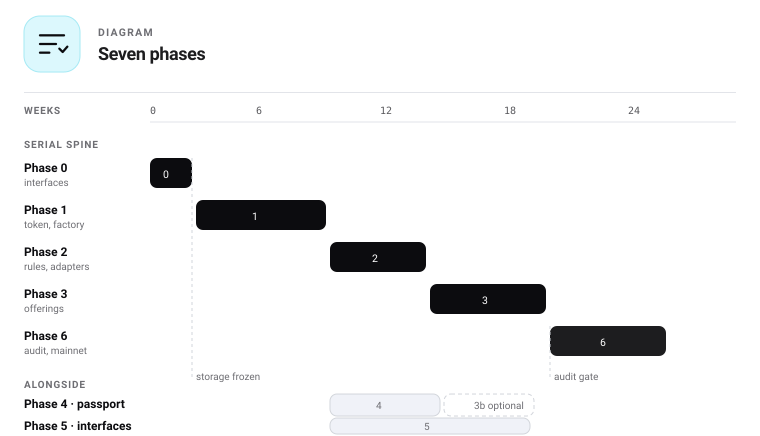

# 20 — Development plan

Seven phases, each ending in something releasable and independently useful. Every task carries its
registry ID from [24](24-work-registry.md), so the plan and the register cannot drift.

Estimates assume **two Solidity engineers, one front-end engineer, one part-time designer and writer**,
and should be re-estimated the day `IF-01` compiles. Everything before that is an estimate about code
nobody has written.



## How to read this

| Column | Means |
|---|---|
| **Task** | The work, with its ID in [24](24-work-registry.md) |
| **Output** | The file or artefact that exists when it is done |
| **Proves** | The check that says so — a test, a script or a CI job |

A task with no entry in the third column is not planned work. It is an intention.

---

## Phase 0 — Interface package · 1–2 weeks

**Goal.** The design is checked by a compiler rather than by reading.

| Task | Output | Proves |
|---|---|---|
| `IF-01` Every interface from [07](07-functions.md) as Solidity with NatSpec, no bodies | `src/interfaces/*.sol` | `forge build` |
| `IF-02` Every storage struct from [04](04-storage.md), with namespaced slots | `src/storage/*.sol`, `Slots.sol` | `L3.3`, `L3.4` |
| `IF-03` Every event and error from [14](14-events-errors.md) | `IEvents.sol`, `IErrors.sol` | `L3.5` |
| `IF-04` Foundry skeleton, remappings, formatter, CI wiring | `foundry.toml`, workflows | CI runs on a pull request |

**Exit criteria.** `forge build` succeeds. Storage layout is frozen. `L3.1` and `L3.2` run in CI, so
the function reference and the interfaces can no longer disagree.

**Why it is first, and alone.** The storage layout is the single decision that cannot be revised once
facets exist — a diamond shares storage, and a struct that needs a field inserted rather than appended
means a migration of live balances. Phase 0 costs two weeks; getting it wrong costs a redeployment
and every holder's trust.

> **Gate.** Nothing in Phase 1 or 2 starts until `IF-02` is merged.

---

## Phase 1 — Core token and factory · 5–7 weeks

**Goal.** A conformant ERC-7943 token anyone can deploy, with no dependency on us.

| Task | Output | Proves |
|---|---|---|
| `CO-01` Diamond core: immutable ERC-20, ERC-2612, fallback router | `uRWAToken.sol` | `L4.1` — selectors cannot be replaced |
| `CO-02` Cut and loupe facets | facets | Loupe report matches the published package |
| `CO-03` `ComplianceFacet`: pipeline, ERC-7943 views, `whyBlocked` | facet | `L4.2` — no view reverts, fuzzed |
| `CO-04` Trust list and global pause | facet | `L4.9` — trust never bypasses pause |
| `CO-05` Subject-level holder accounting | facet | `L4.5`, `L4.6` — caps count subjects |
| `CO-06` Freeze and lockup with a composed frozen total | facets | `L4.11` — frozen may exceed balance |
| `CO-07` `MonetaryFacet`: issue, redeem, distribute, caps | facet | `L4.7` — `totalIssued` monotonic |
| `CO-08` `RolesFacet` | facet | `L4.8` — upgrade admin cannot move a balance |
| `CO-12` Per-address pause, both directions, reason evented | facet | A paused address can neither send nor receive |
| `CO-13` Configurable upgrade delay, exposed for the verifier | facet | The delay is readable without storage access |
| `CO-09` Treasury clone | `Treasury.sol` | One treasury per token |
| `CO-10` Factory: create, packages, presets, registry | `uRWAFactory.sol` | `L4.13` — deploys on a clean chain |
| `CO-11` ERC-1404 compatibility surface | facet | Legacy integrators read a reason code |
| `ID-01`, `ID-02` Identity interface and the allowlist adapter | adapters | A fork runs on tier 0 alone |
| `TO-01` **ERC-7943 conformance kit, separate repository** | test suite | Passes against a token this factory issued |

**Exit criteria.**

- `supportsInterface(0x3edbb4c4)` is true
- The conformance kit passes, including the must-not-revert guarantee for unknown wallets
- Deployed and verified on Base Sepolia, with a loupe report published
- **A fresh-chain CI job deploys the whole stack with no Stobox contract present and completes a transfer**

The last one is the open-source claim as a build step rather than a promise.

---

## Phase 2 — Policy engine and rules · 4–5 weeks

**Goal.** Compliance becomes configuration instead of code.

| Task | Output | Proves |
|---|---|---|
| `PO-01` `PolicySet`: AND groups of OR alternatives, 100,000-gas ceiling, rule cap | `PolicySet.sol` | A reverting rule counts as a refusal |
| `PO-02` `HasValidIdentity` | rule | The base gate every preset includes |
| `PO-03` Jurisdiction allow and deny | rules | Countries compared as hashes |
| `PO-04` `USAccreditedOnly`, `EUProfessionalOnly`, `EUQualifiedExemption` | rules | Separate tests, not one `accredited` flag |
| `PO-05` `MaxHolders`, `MaxBalancePerHolder` | rules | One investor, three wallets, one holder |
| `PO-06` `HoldPeriod`, `TransferWindow` | rules | Composes with admin freezes |
| `PO-07` `SanctionsScreen`, `TravelRuleThreshold` | rules | Freshness enforced by the rule, not the registry |
| `PO-09` The four MiCA rules — issuer, class, whitepaper, reserve | rules | A stale reserve stops the whole token |
| `PO-08` Four presets registered in the factory | factory config | Preset composition matches [10](10-rules.md#presets) |
| `ID-03` EAS adapter | adapter | Base-native attestations |
| `ID-04` StoboxDID adapter, `try/catch` on every call | adapter | **Every view returns for unknown, zero and contract addresses** |

**Exit criteria.** A token switches regime with one `setPolicySet` call and no balance moves. `ID-04`
carries the known integration defect and does not ship without the test that proves it is handled.

---

## Phase 3 — Custody and offerings · 5–6 weeks

**Goal.** Primary issuance, with investor money protected by construction.

| Task | Output | Proves |
|---|---|---|
| `CU-01` Treasury reservation and payment locking | `Treasury` | Payment is not withdrawable below soft cap |
| `CU-02` Offering registry: governance and storage facets | diamond | Read path unaffected by write-path upgrades |
| `CU-03` Purchase, allocations, tiered pricing, multiple payment tokens | facet | A purchase over the remaining cap reverts whole |
| `CU-04` Dual-path refunds with idempotency | facet | `L4.10` — no purchase refunds twice |
| `CU-05` Offering-level rule engine | facet | Passing the offering never implies the right to hold |
| `CU-06` `PurchaseFacet` on the token side | facet | The distribution leg runs the full pipeline |

**Exit criteria.** A raise runs end to end on testnet: subscribe, miss the soft cap, refund without
the operator; then subscribe, meet it, settle. Both `settle` and `beginRefunding` callable by anyone.

---

## Phase 3b — Agents and settlement · 3–4 weeks, optional

**Goal.** Automation and atomic settlement, as separate contracts nobody is forced to install.

| Task | Output | Proves |
|---|---|---|
| `AG-01` `AgentAuthority`: mandates, scopes, epoch limits, revoke | contract | `L4.15` — no action exceeds its mandate |
| `AG-02` `AtomicDvP`: settle, preview, cancel | contract | `L4.14` — both legs or neither |
| `AG-03` EIP-712 instruction format and signature verification | library | A replayed nonce cannot settle |
| `AG-04` Reference monitoring agent | package | Reads only; demonstrates the mandate model |

**Why it is separate.** Both call *into* the token and are never dependencies of it. Keeping them out
of the default package keeps the audited perimeter small and lets a plain issuance ship without them.

---

## Phase 4 — Passport and proofs · 4–5 weeks

**Goal.** Evidence about the asset, provable by anyone, without disclosing anything.

| Task | Output | Proves |
|---|---|---|
| `PA-01` `IAssetPassport` and the handshake | contract | Declared ≠ confirmed |
| `PA-02` Sparse Merkle tree, salted leaves, revocation tree | library | **Absence is provable** |
| `PA-03` Reference passport — mechanism only, no schema | contract | A fork writes its own passport |
| `PA-04` Verifier library, dependency-free, separate package | package | Verifies without calling us |
| `PA-05` Attestor registry with key validity windows | contract | Signature checked against the key valid at signing |
| `PA-06` Access grants: group-scoped, expiring, revocable | contract | Every grant expires |
| `PA-07` `PassportValidRule` — optional | rule | Passport gating stays the issuer's choice |

**Exit criteria.** A third party verifies a disclosed datapoint and an absent one, using only the
published library and a public node. **Depends on Phase 1 only** — it can run alongside Phase 2 or 3.

---

## Phase 5 — Interfaces · runs from Phase 2, 6–8 weeks total

**Goal.** Every job in [28](28-product-model.md) reachable from a surface.

| Task | Output | Proves |
|---|---|---|
| `TO-04` TypeScript SDK and published ABIs | package | ABIs generated from build artefacts |
| `UI-01` Wallet connection and identity resolution | module | The seven connection states in [21](21-interface-specification.md) |
| `UI-09` Deploy console — eight steps, no default for delay or emergency facet | app | Both governance choices are explicit |
| `UI-02`…`UI-06` Deploy, token, verifier, investor, compliance surfaces | app | Every job maps to a surface |
| `UI-10` Verifier shows delay, emergency facet, fee and passport state | app | Four facts a holder would otherwise read from storage |
| `UI-07` Passport proof verifier | app | No account, no wallet, no cooperation |

**Exit criteria.** The public verifier answers for a token deployed by someone else, on a chain we do
not operate.

---

## Phase 6 — Audit and mainnet · 4–6 weeks plus remediation

**Goal.** Independent confirmation, then issuance.

| Scope | In this audit |
|---|---|
| Token diamond and every facet | ✅ |
| Policy engine and rule library | ✅ |
| Treasury and offering registry | ✅ |
| Factory | ✅ |
| Agents and atomic DvP | Later pass |
| Passport | Later pass |

**Exit criteria.** Findings resolved or accepted in writing, signed release with the report attached,
mainnet deployment manifest published. **No mainnet issuance until it clears.**

---

## Critical path and what runs alongside

```
  0 ──▶ 1 ──▶ 2 ──▶ 3 ──▶ 6          the serial spine
             │      └──▶ 3b          optional, before or after 6
             └──▶ 4                  needs only Phase 1
             └──▶ 5                  starts once Phase 1 interfaces settle
```

| | Weeks |
|---|---|
| Serial spine, 0 → 1 → 2 → 3 → 6 | **19–26** |
| With 3b and 4 sequential instead of parallel | 26–35 |
| Interfaces, absorbed into the spine | +0 if staffed from Phase 2 |

The audit gates **mainnet**, not publication. Code and testnet deployments are public from the end of
Phase 1, which is when outside review becomes possible and therefore useful.

## Decision gates

Points where the plan stops until someone decides.

| Gate | Before | Needs |
|---|---|---|
| Storage frozen | Phase 1 | `IF-02` merged and reviewed |
| Claim schema v1 frozen | `PO-02` | The MiCA key names confirmed against a real configuration |
| Freshness windows per group | `PA-03` | A number per group, from the attestation policy |
| Audit firm engaged | Phase 6 | Booked at the start of Phase 3 — lead times run to months |

## Team

| Role | Phases | Load |
|---|---|---|
| Solidity engineer × 2 | 0–4, 6 | Full |
| Front-end engineer | 5 | Full from Phase 2 |
| Designer | 5 | Part-time |
| Technical writer | All | Part-time — documentation ships with each phase |
| Security reviewer | 3, 6 | External |

## Definition of done, every phase

1. Tests pass and coverage meets the targets in [23](23-testing-plan.md)
2. Documentation updated **in the same pull request** as the code
3. `build-docs.py` regenerated and committed; `verify.py` and `--self-test` both green
4. Deployment manifest updated
5. Every invariant in [17](17-security.md) still asserts
6. The fresh-chain fork test passes

## Risks

| Risk | Mitigation |
|---|---|
| Storage layout wrong, found late | Phase 0 exists for this, and `L3.7` diffs every release |
| Diamond complexity slows the audit | Loupe report and verification tooling ship in Phase 1 |
| Scope creeps through Phases 3 and 5 | Each phase is independently releasable; deferring one strands nothing |
| Pipeline gas exceeds expectations | Measured from Phase 1; the order in [08](08-compliance-pipeline.md) puts the cheap path first |
| StoboxDID revert behaviour reaches production | An explicit exit criterion on `ID-04`, not a code review note |
| A MiCA rule stops a whole token unexpectedly | Documented in [10](10-rules.md); the console warns at configuration time |
| Audit lead time delays mainnet | Book at the start of Phase 3, not the end of Phase 5 |

## Related documents

- [24 — Work registry](24-work-registry.md) — every task with dependencies and effort
- [23 — Testing plan](23-testing-plan.md) — what each phase must prove
- [21 — Interface specification](21-interface-specification.md) — Phase 5 in detail
- [16 — Deployment](16-deployment.md) — chains, addresses and order
