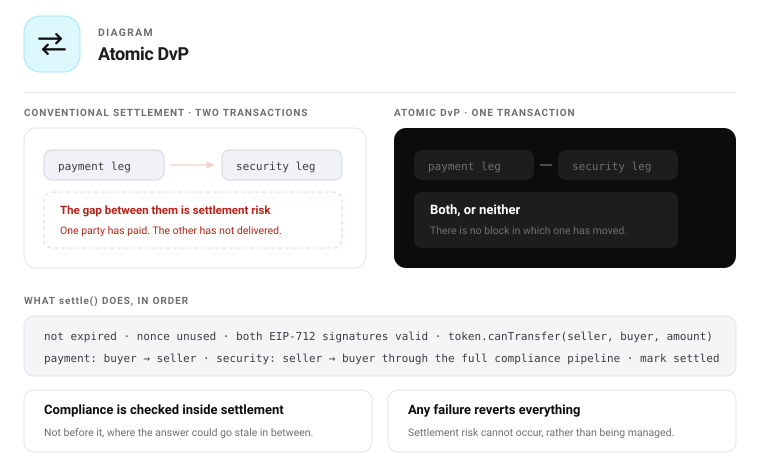
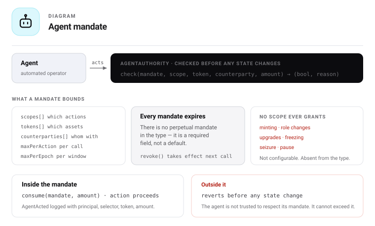

# 22 — Agents and settlement

## Why this system is agent-native

Autonomous agents fail on financial rails for one structural reason: **they cannot predict the outcome
of an action before taking it.** They submit, the transaction reverts, gas is spent, and — worse — a
multi-step flow leaves partial state behind that a machine cannot reliably unwind.

Three properties already in this design remove that failure mode. None were added for agents; they
follow from ERC-7943 conformance.

| Property | What it gives an agent |
|---|---|
| `canTransfer` is a free, non-reverting view | Deterministic pre-flight. The agent computes the outcome before acting, at zero cost. |
| `whyBlocked` returns stage, rule address and reason | A machine-readable *cause*, so the agent can reason rather than retry blindly. |
| ERC-7943 is a standard interface | One integration serves every conformant token. No per-asset adapter. |
| Atomic DvP settles both legs or neither | No partial state ever exists for an agent to reconcile. |

An agent that must guess is dangerous. An agent that can ask is ordinary infrastructure.

---

## Single-ledger settlement

### The problem it removes

Conventional settlement runs two ledgers: securities at a CSD, cash at a bank. Delivery and payment
happen in different systems, so they cannot be simultaneous. The gap is bridged with T+2, reconciliation
and a counterparty who might not perform — settlement risk that is *managed* rather than *absent*.

### What replaces it

Both legs are ERC-20 transfers on the same chain in the same transaction.

```
   Traditional                        Single ledger

   securities ledger ──┐              ┌─────────────────────┐
                       ├─ reconcile   │  one transaction    │
   cash ledger ────────┘   T+2        │  security ⇄ payment │
                                      │  both or neither    │
   settlement risk: managed           └─────────────────────┘
                                      settlement risk: structurally absent
```

Settlement risk is not reduced. It cannot occur, because there is no interval during which one leg has
moved and the other has not.

### The part that is genuinely new

Compliance is evaluated **inside** the settlement, not before and after it.

In a conventional flow the transfer agent checks eligibility, the trade settles elsewhere, and a
reconciliation later confirms nothing went wrong. Here the security leg passes the token's own
compliance pipeline as part of the atomic operation. A non-compliant trade **cannot settle** — not "is
detected and reversed", but cannot occur.

That is only possible because the compliance system and the settlement system are the same system.

---

## AtomicDvP



```solidity
struct Instruction {
    address securityToken;
    address paymentToken;
    address seller;
    address buyer;
    uint256 securityAmount;
    uint256 paymentAmount;
    uint64  validUntil;
    bytes32 nonce;
    bytes32 tradeRef;        // reporting reference, opaque to the contract
}

interface IAtomicDvP {
    function settle(Instruction calldata i, bytes calldata sellerSig, bytes calldata buyerSig)
        external returns (bytes32 settlementId);

    function previewSettle(Instruction calldata i)
        external view returns (bool ok, uint8 stage, address rule, string memory reason);

    function cancel(Instruction calldata i) external;
    function digestOf(Instruction calldata i) external view returns (bytes32);
    function isSettled(bytes32 digest) external view returns (bool);
}
```

**Settlement state is keyed by the instruction digest, not the bare nonce.** The nonce alone does not
name the parties, so a state keyed on it conflates two different trades that share one — which let a
bystander cancel a trade they were not part of by forging an instruction with the victim's nonce. The
digest binds every term, so a forged instruction reaches only its own state, never a genuine trade's.
A caller asking whether a trade settled passes the instruction through `digestOf` first.

### Execution order

```
 1. instruction not expired, neither party is the zero address
 2. digest unused (not settled, not cancelled)
 3. both signatures valid (EIP-712)        ← either party or their agent may submit
 4. token.canTransfer(seller, buyer, securityAmount)   ← revert with the rule's reason if false
 5. paymentToken:  buyer  → seller
 6. securityToken: seller → buyer          ← runs the full compliance pipeline
 7. mark digest settled, emit Settled
```

Step 3 is a courtesy that makes failures legible: step 5 would enforce it anyway, but reverting early
returns the *rule and reason* rather than a bare failure. `previewSettle` runs steps 1–3 in view mode
and is what an agent calls before it ever constructs a transaction.

### Why signatures rather than approvals

Both parties sign the instruction off-chain. Either side — or either side's agent — submits it. This
means no party ever grants a standing allowance to a counterparty, the trade terms are fixed at
signing, and the submitter pays gas. A matching agent can therefore execute a trade it negotiated
without ever holding custody of either leg.

### Properties

| Property | Mechanism |
|---|---|
| Atomicity | Single transaction; any failure reverts both legs |
| No custody by intermediaries | Signatures, not escrow |
| Compliance-integrated | Security leg passes the full pipeline |
| Replay-safe | Nonce marked settled; `cancel` invalidates unilaterally, by a party |
| Reportable | `tradeRef` plus a `Settled` event carrying both legs |
| Front-running resistant | Terms are signed; a third party cannot alter price or size |

---

## Agent authority

Agents act **for a principal**, never in their own right. The agent's wallet is linked to the
principal's DID subject, so it inherits the principal's eligibility — and, because holder caps count
subjects, adding agent wallets never inflates the holder register.



Eligibility is not authority. Authority is separate, explicit and on-chain.

```solidity
struct Mandate {
    bytes32   principal;        // DID subject the agent acts for
    address   agent;            // agent wallet
    bytes32[] scopes;           // permitted action classes
    address[] tokens;           // asset allowlist; empty = any
    address[] counterparties;   // permitted counterparties; empty = any eligible
    uint256   maxPerAction;
    uint256   maxPerEpoch;
    uint64    epochLength;
    uint64    expiresAt;        // always set — no perpetual mandate
    bool      revoked;
}

interface IAgentAuthority {
    function grant(Mandate calldata m) external returns (bytes32 mandateId);
    function revoke(bytes32 mandateId) external;              // immediate, no timelock
    function check(bytes32 mandateId, bytes32 scope, address token,
                   address counterparty, uint256 amount) external view returns (bool, string memory);
    // consume enforces the same dimensions as check — the state-changing mirror.
    function consume(bytes32 mandateId, bytes32 scope, address token,
                     address counterparty, uint256 amount) external;
    function consumed(bytes32 mandateId) external view returns (uint256 thisEpoch, uint64 epochEnds);
    function mandatesOf(bytes32 principal) external view returns (bytes32[] memory);
}
```

### Scopes

| Scope | Permits | Never permits |
|---|---|---|
| `AGENT_DISTRIBUTE` | `distributeFromTreasury` within limits | Minting |
| `AGENT_LOCKUP` | `addLockup` on distributions it made | Clearing another party's lockups |
| `AGENT_SETTLE` | Submit signed DvP instructions | Signing on the principal's behalf |
| `AGENT_QUOTE` | Publish quotes; sign instructions within a price band | Exceeding inventory or band |
| `AGENT_READ` | Everything readable | Nothing else |

**Never in any scope:** minting, role changes, diamond cuts, policy-set swaps, freezing, seizure,
pause. Those require a human role holder. An agent cannot expand its own mandate, and there is no
scope that would let it.

### Limits are enforced, not advisory

Every privileged agent call passes through `check`. Exceeding `maxPerAction`, exhausting
`maxPerEpoch`, addressing a token outside the allowlist, facing a counterparty outside the list, or
running past `expiresAt` reverts. The agent is not trusted to respect its mandate — it is unable to
exceed it.

`revoke` is immediate and has no timelock. This is the kill switch, and a delay would defeat its
purpose.

---

## The three agent roles

### Issuer operations

Automates what an operations team does by hand: distributions to a holder list, applying lockups on
issuance, treasury rebalancing, responding to offering events, and reporting.

| Task | Scope | Bound |
|---|---|---|
| Distribute to an approved list | `AGENT_DISTRIBUTE` | Per-action and per-epoch caps, token allowlist |
| Apply lockups on distribution | `AGENT_LOCKUP` | Only on its own distributions |
| Publish cap-table and compliance reports | `AGENT_READ` | — |
| Alert on blocked transfers and `RuleFailed` | `AGENT_READ` | — |

The last one is worth its own note. `RuleFailed` means a rule contract is malfunctioning — an
operational fault, not a compliance outcome. It is exactly the signal a monitoring agent should raise
immediately and a human should see the same hour.

### Market maker and matching

Quotes two-sided prices and matches counterparties, then settles atomically.

| Task | Scope | Bound |
|---|---|---|
| Publish quotes | `AGENT_QUOTE` | Price band, inventory limit |
| Sign instructions within band | `AGENT_QUOTE` | `maxPerAction`, `maxPerEpoch` |
| Submit matched instructions | `AGENT_SETTLE` | Counterparty allowlist |

A matching agent needs neither leg in custody: it collects two signatures and submits. Its worst-case
failure is a trade at a bad price within the band, never loss of the assets.

### Agent-to-agent (M2M)

Two agents negotiate and settle directly, with no human in the loop on either side. This is where the
pre-flight property stops being a convenience and becomes a requirement.

```
  Agent A                          Agent B
     │  previewSettle(instruction)    │      ← both check independently, free
     │◀──── ok / reason ─────────────▶│
     │  sign                           │  sign
     │            AtomicDvP.settle     │
     └───────────────▶ ◀──────────────┘
                    both legs or neither
```

Neither agent can strand the other. Neither needs to trust the other's compliance state — both verify
it directly against the token. If either side is ineligible, `previewSettle` says so before a
signature exists.

---

## Agent-facing read surface

Formalised so an agent integrates once, against any conformant token.

| Question | Call |
|---|---|
| May this transfer proceed? | `canTransfer(from, to, amount)` |
| If not, why? | `whyBlocked(from, to, amount)` → stage, rule, reason |
| What is actually movable? | `unfrozenBalanceOf(account)` |
| When does the rest unlock? | `lockupsOf(account)` |
| What rules apply? | `policySet.groups()`, `rulesOf(group)`, `rule.ruleId()` |
| What are the bounds for this account? | `rule.bounds(account)` |
| Will this trade settle? | `previewSettle(instruction)` |
| Am I authorised? | `agentAuthority.check(...)`, `consumed(...)` |
| Is the asset record current? | `passport.snapshotOf(id)` → snapshot, stale flag |

Every one is a free view call that does not revert. An agent can build a complete picture of what it
may do, and why, without submitting anything.

---

## Attribution and audit

Every agent action is attributable to a mandate and a principal.

```solidity
event AgentActed(
    bytes32 indexed mandateId,
    address indexed agent,
    bytes32 indexed principal,
    bytes4  selector,
    address token,
    uint256 amount
);

event MandateGranted(bytes32 indexed mandateId, bytes32 indexed principal, address indexed agent, uint64 expiresAt);
event MandateRevoked(bytes32 indexed mandateId, address indexed by);
event Settled(bytes32 indexed settlementId, address indexed securityToken, address indexed paymentToken,
              address seller, address buyer, uint256 securityAmount, uint256 paymentAmount, bytes32 tradeRef);
```

From logs alone: which agent did what, under whose mandate, within which limits, and what remained.
An agent-executed action is never indistinguishable from a human one — that distinction must survive
into the audit trail, and it does.

---

## Failure modes

| Failure | Response |
|---|---|
| Agent key compromised | `revoke` is immediate; damage bounded by `maxPerEpoch` already consumed |
| Agent loops on a failing action | Pre-flight is free, so a correct agent never submits; a broken one is bounded by limits and visible in `AgentActed` |
| Agent settles at a bad price | Price band in the quote scope; outside it, signing fails |
| Counterparty becomes ineligible between signing and settling | `settle` reverts atomically — nothing moves |
| Instruction replayed | Nonce marked settled; `cancel` invalidates unilaterally, by a party |
| Mandate outlives its purpose | `expiresAt` is mandatory — no perpetual mandate exists in the type |
| Agent acts outside the asset allowlist | `check` reverts |
| Principal loses track of agents | `mandatesOf(principal)` enumerates all live mandates |

---

## Scope note

Issuer-operations automation and market making are different activities with different operational
profiles, even though both use the same mandate mechanism. The architecture makes the boundary
explicit and enforceable through scopes and limits, so that whichever profile applies, the agent's
actual authority is visible on chain and bounded by construction.

Stobox supplies the mechanism. Which activities a given principal may delegate, and under what
conditions, is the principal's determination.

---

## Build placement

| Item | Phase |
|---|---|
| Agent read surface | Already exists — Phase 1 and 2 deliver it |
| `AgentAuthority` | Phase 3, alongside offerings |
| `AtomicDvP` | Phase 3 |
| `previewSettle` | Phase 3 |
| Agent SDK and reference monitoring agent | Phase 5, with the interfaces |

Nothing here requires a change to the token. `AtomicDvP` and `AgentAuthority` are external contracts
that use the existing surface — which is the strongest evidence that the three-plane split was drawn
in the right place.

## Related documents

- [07 — Function reference](07-functions.md)
- [08 — Compliance pipeline](08-compliance-pipeline.md)
- [20 — Development plan](20-development-plan.md)
