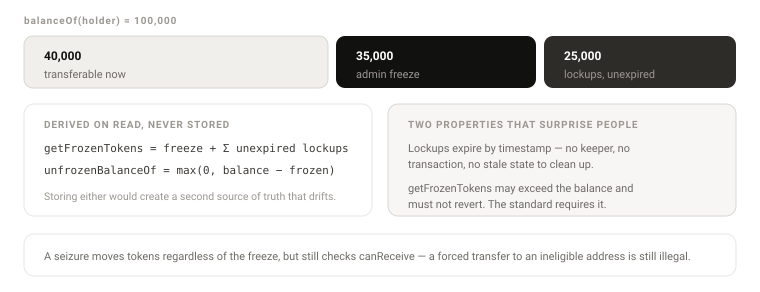

# 29 — Data model

Every entity, what holds it, what relates it, and what may never be untrue about it. An entity
without an owner, a lifecycle and at least one invariant is not modelled — it is assumed.

## Entities

| ID | Entity | Owned by | Keyed by | Lives |
|---|---|---|---|---|
| E-01 | **Token** | `uRWAToken` | address | On chain, forever |
| E-02 | **Balance** | `CoreStorage` | address | On chain |
| E-03 | **Subject** | Identity registry | `bytes32` from the DID | On chain, external |
| E-04 | **Wallet** | Identity registry | address | On chain, external |
| E-05 | **Claim** | Identity registry | (subject, key) | On chain, external |
| E-06 | **Admin freeze** | `FreezeStorage` | address | On chain |
| E-07 | **Lockup** | `LockupStorage` | (address, index) | On chain, expires by time |
| E-08 | **Rule** | Rule contract | address | On chain, stateless |
| E-09 | **Policy set** | `PolicySet` | address | On chain, replaceable |
| E-10 | **Role assignment** | `RolesStorage` | (role, address) | On chain |
| E-11 | **Trust entry** | `ComplianceStorage` | address | On chain |
| E-12 | **Treasury** | `Treasury` | address, one per token | On chain |
| E-13 | **Offering** | `OfferingRegistry` | uint256 | On chain |
| E-14 | **Purchase** | `OfferingRegistry` | uint256 | On chain |
| E-15 | **Passport** | `AssetPassport` | `bytes32` | On chain, proprietary |
| E-16 | **Snapshot** | `AssetPassport` | (passport, version) | On chain |
| E-17 | **Datapoint** | Off-chain record | (passport, code) | **Off chain**, committed |
| E-18 | **Attestation** | `AssetPassport` | (passport, attestor, group) | On chain, metadata only |
| E-19 | **Access grant** | `AssetPassport` | (passport, grantee) | On chain, expires |
| E-20 | **Token link** | `AssetPassport` + token | (passport, token, chainId) | On chain, both sides |
| E-21 | **Mandate** | `AgentAuthority` | `bytes32` | On chain, expires |
| E-22 | **Settlement** | `AtomicDvP` | nonce | On chain |
| E-23 | **Deployment** | `uRWAFactory` | token address | On chain |

## Relationships

```
              ┌──────────┐
              │  Subject │ E-03
              └────┬─────┘
        1..n ┌─────┴─────┐ 1..n
             ▼           ▼
        ┌────────┐  ┌────────┐
        │ Wallet │  │ Claim  │ E-05
        └───┬────┘  └────────┘
            │ 1..n
            ▼
        ┌─────────┐   1..n    ┌──────────┐   1..n   ┌────────┐
        │ Balance │◀──────────│  Token   │─────────▶│ Lockup │
        └─────────┘           └────┬─────┘          └────────┘
                                   │ 1
                    ┌──────────────┼──────────────┐
                    ▼              ▼              ▼
              ┌──────────┐  ┌────────────┐  ┌──────────┐
              │ Treasury │  │ Policy set │──│   Rule   │ 1..n
              └────┬─────┘  └────────────┘  └──────────┘
                   │ 1..n
                   ▼
              ┌──────────┐   1..n   ┌──────────┐
              │ Offering │─────────▶│ Purchase │
              └──────────┘          └──────────┘

        ┌───────────┐  handshake   ┌────────┐
        │ Passport  │◀────────────▶│ Token  │   1 passport : n tokens
        └─────┬─────┘   both sides └────────┘
     1..n ┌───┴───┬────────┬──────────┐
          ▼       ▼        ▼          ▼
     Snapshot  Datapoint  Attestation  Access grant
      E-16      E-17       E-18         E-19
```

### Cardinalities that matter

| Relationship | Cardinality | Why it matters |
|---|---|---|
| Subject → Wallet | 1 : n | **Holder caps count subjects.** Counting wallets is the classic evasion. |
| Passport → Token | 1 : n | One asset, several tranches or chains. Each link confirmed separately. |
| Token → Policy set | 1 : 1, replaceable | Swapping is one transaction; no balance moves. |
| Token → Treasury | 1 : 1 | Isolation. A compromise reaches one asset. |
| Offering → Payment token | 1 : n | Multi-currency raises. |
| Wallet → Subject | n : 1, may be 0 | A wallet with no subject gets a synthetic one so counts never under-report. |

## The on-chain / off-chain split

This is the line the whole disclosure design rests on.

| Held on chain | Held off chain |
|---|---|
| Balances, supply, allowances | Datapoint **values** |
| Frozen amounts and lockup schedules | Documents of every kind |
| Rule addresses and their parameters | Personal data of any kind |
| Role assignments, trust list with reasons | Attestation **contents** |
| Claim hashes, issuer, expiry, revocation | Raw claim values |
| Snapshot roots, revocation roots | The datapoint tree itself |
| Attestation **metadata** — who, when, valid until | |
| Access grants and their terms hash | |
| Every event | |

**No personal data crosses, hashed or otherwise.** A hash of a passport number is still personal
data — a pseudonym, re-identifiable by anyone who can guess the input — and anchoring it makes an
erasure request impossible to honour permanently. Person-level facts live in the claims plane, keyed
to a subject, and never enter the passport tree. See [11](11-passport.md).

## Entity detail

Every entity in the table above appears here with at least one invariant. An entity with no invariant
is an assumption wearing a model's clothes, so the verifier refuses to let one exist — `L2.6`.

### E-01 Token

```
diamond address, name, symbol, decimals, maxSupply, totalIssued,
capLocked, policySet, identityRegistry, treasury, paused
```

**Invariants**
1. The ERC-20 selectors registered against the diamond can never be replaced or removed. This is
   enforced by `LibDiamond`, not by convention.
2. `supportsInterface(0x3edbb4c4)` is true for the life of the token.
3. The token functions with the passport, the factory and the offering registry all absent.
4. No token state references a Stobox address in the open distribution.

### E-03 Subject and E-04 Wallet

```
subject   bytes32     keccak256 of the DID identifier
wallets   address[]   1..n, each may be independently deactivated
active    bool        derived: DID unexpired AND unblocked AND wallet not deactivated
```

**Invariants**
1. A wallet maps to at most one subject, enforced when the link is made rather than reconciled later.
2. A wallet with no subject is assigned `keccak256(wallet)` as a synthetic subject.
3. `subjectBalanceOf(s)` equals the sum of balances across all wallets of `s`.
4. Deactivating one wallet never changes another wallet's eligibility.
5. The wallet set is **not issuer-controlled** — the holder adds wallets themselves, up to the
   registry's cap. Only the subject count is enforceable, which is why caps count subjects.
6. Wallet deactivation is reversible by the holder and is therefore never an enforcement signal.
   Stopping a person is a subject-level operation. See [09](09-identity-did.md).

### E-05 Claim

```
valueHash   bytes32   hashed value; never plaintext
numeric     uint256   optional bound for thresholds
issuedAt    uint64
expiresAt   uint64    0 = no expiry
issuer      address   the attesting authority
revoked     bool
```

**Invariants**
1. Absent, expired and revoked are three distinguishable states.
2. Revocation takes effect on the next transfer — there is no cache.
3. A claim is never returned as valid past `expiresAt`.
4. Reading a claim never reverts, including for unknown subjects.

### E-02 Balance and E-06/E-07 restrictions



```
balanceOf(a)          = free + adminFrozen + Σ(unexpired lockups)
getFrozenTokens(a)    = adminFrozen + Σ(unexpired lockups)      may exceed balance
unfrozenBalanceOf(a)  = max(0, balanceOf(a) − getFrozenTokens(a))
```

**Invariants**
1. `Σ balances == totalSupply`.
2. `Σ subjectBalance == totalSupply`.
3. `totalSupply <= maxSupply` when the cap is set.
4. `totalIssued` never decreases.
5. `capLocked` never goes from true to false.
6. Lockups expire by timestamp — no transaction, no keeper, no stale state.
7. `getFrozenTokens` never reverts.

### E-08 Rule and E-09 Policy set

```
Rule       stateless contract; parameters immutable at deployment
PolicySet  groups[] → rules[], each group ANY-of, groups AND-ed together
```

**Invariants**
1. A rule never writes. It reads claims and token views and returns a verdict.
2. A rule is called under a gas ceiling; exceeding it counts as a rejection, never as a pass.
3. A rule that reverts counts as a rejection and emits `RuleFailed`. Failure never opens the gate.
4. Replacing the policy set moves no balance and changes no supply.
5. A policy set with zero groups permits every transfer — which is why the empty set is a deliberate
   configuration, never a default.

### E-10 Role assignment and E-11 Trust entry

```
RoleAssignment  role, account, grantedAt, grantedBy
TrustEntry      account, reason, addedAt, addedBy
```

**Invariants**
1. Every role has at least one holder, or the function it guards is permanently unreachable.
2. `UPGRADE_ADMIN` cannot change any balance, directly or through a facet it installs — the ERC-20
   core is not replaceable.
3. Every trust entry carries a non-empty reason. An unexplained exemption is indistinguishable from
   an attack.
4. Trust never bypasses pause or a frozen balance. It skips claim and rule evaluation only.

### E-12 Treasury

```
token, balance, reservations[offeringId], releasedAt
```

**Invariants**
1. One treasury per token. A compromise reaches exactly one asset.
2. Payment held against an unsettled offering below its soft cap is not withdrawable by the issuer.
3. `Σ reservations <= balance`.
4. The treasury holds tokens as an ordinary holder — the compliance pipeline applies to it too, which
   is why the factory adds it to the trust list explicitly rather than special-casing it in code.

### E-13 Offering and E-14 Purchase

```
Offering   token, paymentTokens[], price or tiers, softCap, hardCap,
           startAt, endAt, min, max, lockupUntil, preMint, regime, status
Purchase   offeringId, investor, subject, paid, tokens, unlockAt, state
```

**Invariants**
1. An offering reaches exactly one terminal state: Settled, Refunding or Cancelled — then Archived.
2. `Closed → Refunding` is reachable without operator action once the soft cap is missed.
3. A purchase in `Refunded` cannot be refunded again by either path.
4. Payment tokens are not withdrawable while any offering holding them is unsettled below soft cap.
5. `Σ purchases.tokens <= offering.hardCap`.

### E-15…E-20 Passport

```
Snapshot     root, revocationRoot, version, takenAt, schemaVersion
Datapoint    code, valueHash, salt, attestor, issuedAt, validUntil   ← off chain
Attestation  attestor, group, issuedAt, validUntil, revoked
AccessGrant  grantee, groups[], expiresAt, termsHash, revoked
TokenLink    token, chainId, confirmed
```

**Invariants**
1. Every datapoint leaf carries 32 bytes of unique salt. Without it, an enum or boolean commitment is
   broken by hashing every candidate.
2. Absence is provable — the tree spans the whole key space.
3. A proof verifies only against the root it was made for.
4. A revoked attestation is not provable as live.
5. A signature is checked against the attestor key valid **at signing time**.
6. Every access grant expires. There is no perpetual grant in the type.
7. A token link is provenance only in the **Confirmed** state; declared-but-unconfirmed is what a
   forgery looks like.

### E-21 Mandate

```
principal, agent, scopes[], tokens[], counterparties[],
maxPerAction, maxPerEpoch, epochLength, expiresAt, revoked
```

**Invariants**
1. Every mandate expires.
2. No scope grants minting, role changes, upgrades, freezing, seizure or pause.
3. Consumption resets per epoch and never exceeds `maxPerEpoch`.
4. `revoke` takes effect on the next action, with no timelock.

### E-22 Settlement and E-23 Deployment

```
Settlement  nonce, parties, securityToken, paymentToken, amounts, expiry, state
Deployment  token, treasury, deployer, package, preset, blockNumber
```

**Invariants**
1. A nonce settles at most once. Replay is impossible, not merely unlikely.
2. An expired instruction cannot settle, even with two valid signatures.
3. Either both legs move or neither does. There is no block in which one has and the other has not.
4. The deployment record is append-only. The factory never edits or removes a past entry.
5. `isFactoryIssued` is answerable by anyone with no account and no cooperation from the deployer.

## Derived data — never stored

Computed on read so it cannot go stale.

| Derived | From |
|---|---|
| `getFrozenTokens` | admin freeze + unexpired lockups |
| `unfrozenBalanceOf` | balance − frozen |
| `isActive(wallet)` | DID validity, block status, wallet deactivation |
| `canSend` / `canReceive` / `canTransfer` | claims + rules + state |
| Snapshot staleness | `takenAt` vs the freshness window |
| Cap table at any block | `Transfer` events |

**Storing any of these would create a second source of truth that drifts.** The one exception is
`subjectBalance` and `subjectHolderCount`, which are maintained in transfer accounting because they
cannot be derived at read time within gas limits — and because they cannot be reconstructed later at
all.

## Schema evolution

| Layer | How it changes | Cost |
|---|---|---|
| Storage structs | Append-only. New field at the end or a `.v2` slot. | Free if append; a migration otherwise, which is why it is forbidden |
| Claim keys | Anyone adds a namespaced key. No core change. | Free |
| Rules | Deploy and attach. | One transaction |
| Policy set | Replace wholesale. | One transaction, no balance moves |
| Datapoint schema | Off chain; `schemaVersion` on the snapshot records which applied | Free |
| Events | Additive only. Never change a signature. | Additive is free; changing one breaks every consumer |

## Related

- [04 — Storage](04-storage.md) — the Solidity structs
- [06 — States](06-states.md) — the lifecycles
- [30 — Interaction model](30-interaction-model.md) — who reads and writes each entity
- [31 — Verification](31-verification.md) — how these invariants are checked
