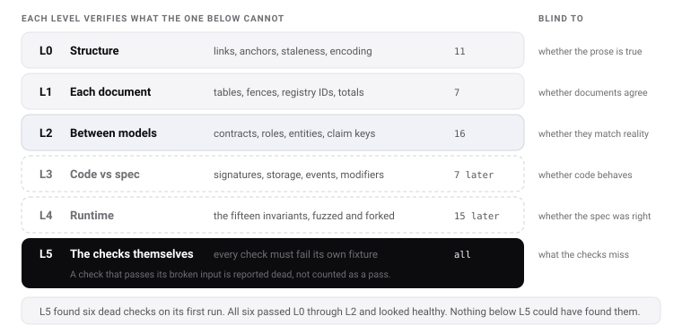

# 31 — Verification framework

Six levels of checking, each verifying something the level below cannot. The top level verifies the
checks themselves, because **a check that never fails is not a check** — it is a comment that costs
CI time.

Everything described here that can run today does run today, in [`verify.py`](../verify.py), on every
commit.

## The levels

| Level | Verifies | Runs | Fails the build |
|---|---|---|---|
| **L0** | Syntax and structure | `verify.py`, CI | ✅ |
| **L1** | Internal consistency of each document | `verify.py`, CI | ✅ |
| **L2** | Consistency **between** models | `verify.py`, CI | ✅ |
| **L3** | Code against specification | Foundry | ✅ once code exists |
| **L4** | Runtime behaviour and invariants | Foundry, fork tests | ✅ once code exists |
| **L5** | **The checks themselves** | `verify.py --self-test`, CI | ✅ |



**Thirty-four checks run today** — eleven at L0, seven at L1, sixteen at L2 — and all thirty-four are
re-run against their own broken fixtures at L5. The twenty-two L3 and L4 checks are specified below
and implemented with the code they test.

## L0 — Structure

Cheap, mechanical, catches rot before anyone reads.

`L0.6` compares a SHA-256 digest of every source file against a digest stamped into the built HTML.
Timestamps would be useless here: a fresh clone gives every file the same mtime, so an mtime
comparison passes in CI no matter how stale the build is — a check that is green precisely where it
matters least.

`L0.11` includes a text-overflow estimate, because SVG does not wrap. A caption edited to be two
words longer does not error and does not wrap — the words are simply not on the canvas, and the
diagram still looks finished. The check measures each label against the viewBox using advance widths
calibrated from rendered output.

It also pins every colour literal to the design tokens. The sixteen diagrams were first drawn in a
warm grey family against pages built from a cool one — near enough to look deliberate, far enough to
read as an off-brand tint. Nothing else in the pipeline would have caught it.

| Check | Rule |
|---|---|
| `L0.1` | Every `docs/*.md` appears in the README index |
| `L0.2` | Every document in the index exists on disk |
| `L0.3` | Document numbers are contiguous with no gaps or duplicates |
| `L0.4` | Every internal link resolves to a real file or anchor |
| `L0.5` | The built HTML has no broken in-page anchors |
| `L0.6` | The built HTML is not stale relative to the sources — by content digest, not timestamp |
| `L0.7` | No raw Markdown leaks into the HTML — no ` |
| `L1.5` | Registry IDs are unique |
| `L1.6` | Every registry item has a status from the declared vocabulary |
| `L1.7` | Artifact register totals match the row counts they claim, per register and overall |

## L2 — Cross-model consistency

**This is the level that catches real drift.** Each rule ties two models together, so a change to one
without the other fails.

| Check | Rule | Catches |
|---|---|---|
| `L2.1` | Every contract and facet in [03](03-contracts.md) appears in [07](07-functions.md); every rule contract appears in [10](10-rules.md) | A contract with no documented API |
| `L2.2` | Every storage struct in [04](04-storage.md) is owned by a contract in [03](03-contracts.md) | Orphan storage |
| `L2.3` | Every role in [05](05-roles.md) is used as an access level in [07](07-functions.md) | A role nobody can exercise |
| `L2.4` | Every access level in [07](07-functions.md) is a role defined in [05](05-roles.md) | An invented permission |
| `L2.5` | Every entity in [29](29-data-model.md) names an owning contract from [03](03-contracts.md) | Unowned data |
| `L2.6` | Every entity has at least one stated invariant | An assumption pretending to be a model |
| `L2.7` | Every actor in [28](28-product-model.md) has at least one job | A decorative persona |
| `L2.8` | Every job names a surface and a contract path | A job that cannot be done |
| `L2.9` | Every surface in [28](28-product-model.md) appears in [21](21-interface-specification.md) | An unspecified screen |
| `L2.10` | Every call in [30](30-interaction-model.md) exists in [07](07-functions.md) | A sequence citing a function that does not exist |
| `L2.11` | Every rule in [10](10-rules.md) reads a claim key declared in [09](09-identity-did.md) | A rule with no data source |
| `L2.12` | Every claim key in [09](09-identity-did.md) is read by a rule, or is explicitly marked reporting-only | A key nothing uses, passing as enforced |
| `L2.13` | Every state in [06](06-states.md) is entered by a named function and left by one | A dead or trapped state |
| `L2.14` | Every artifact in [27](27-model-inventory.md) names an owner and a check | An unowned deliverable |
| `L2.15` | Every glossary term in [18](18-glossary.md) is used somewhere | A stale definition |
| `L2.16` | Every check in this document exists in [`verify.py`](../verify.py), and the reverse | The framework and its implementation drifting apart |

## L3 — Code against specification

Runs once code exists. Listed now so the checks are written before the code, not after.

| Check | Rule |
|---|---|
| `L3.1` | Every function in [07](07-functions.md) exists in the interfaces with a matching signature |
| `L3.2` | Every interface function is documented in [07](07-functions.md) |
| `L3.3` | Every storage struct matches [04](04-storage.md) field for field, in order |
| `L3.4` | Slot constants match the documented strings exactly |
| `L3.5` | Every event and error in [14](14-events-errors.md) exists in Solidity |
| `L3.6` | Every access modifier matches the role in [07](07-functions.md) |
| `L3.7` | Storage structs only ever grow — diffed against the previous release |

## L4 — Runtime

The fifteen invariants in [17](17-security.md), plus the behaviour the standard demands.

| Check | Rule |
|---|---|
| `L4.1` | ERC-20 selectors cannot be replaced or removed |
| `L4.2` | The four view functions never revert, over fuzzed addresses |
| `L4.3` | Removing the compliance facet halts transfers |
| `L4.4` | No value moves outside the pipeline except forced operations |
| `L4.5` | Holder caps count subjects, proven with one investor and three wallets |
| `L4.6` | `Σ balances == Σ subjectBalance == totalSupply` |
| `L4.7` | `totalIssued` monotonic; `capLocked` irreversible |
| `L4.8` | A compromised upgrade admin cannot change a balance |
| `L4.9` | Trust never bypasses pause or frozen balance |
| `L4.10` | A refunded purchase cannot be refunded twice |
| `L4.11` | `getFrozenTokens` may exceed balance without reverting |
| `L4.12` | The fee hook returns zero; no STBU reference exists |
| `L4.13` | The whole stack deploys on a clean chain with no Stobox contract |
| `L4.14` | A payment leg cannot settle without its security leg |
| `L4.15` | No agent action exceeds its mandate |

## L5 — Verifying the verifier

The level everyone skips.

**The problem.** A check that is subtly wrong — a regex that matches nothing, a loop over an empty
list, a comparison that is always true — passes forever and reports health. It is worse than no check,
because it manufactures confidence.

**The method.** Every check ships with a **known-bad fixture**: a deliberately broken copy of the
thing it inspects. The self-test asserts the check *fails* on that fixture. A check that passes its
own broken input is reported as dead.

```
verify.py --self-test

  for each check C:
      1. run C against the real corpus          expect: pass
      2. run C against C's broken fixture       expect: FAIL
      3. if step 2 passed → report "C is dead"  ← the actual finding
```

| Check | Rule |
|---|---|
| `L5.1` | Every check has a known-bad fixture |
| `L5.2` | Every check fails on its fixture — no dead checks |
| `L5.3` | Every check inspects a non-empty set — no check that silently iterates nothing |
| `L5.4` | Every level has at least one check |
| `L5.5` | Every check listed in this document exists in `verify.py`, and vice versa |

`L5.5` is the one that closes the loop: this document and the verifier check each other. Adding a
check here without implementing it fails the build; implementing one without documenting it fails too.

### What L5 caught on its first run

Not a hypothetical. The first `--self-test` run reported six dead checks — `L1.5`, `L1.6`, `L1.7`,
`L2.9`, `L2.14` and `L2.15`. All six had the same defect: their fixtures appended a broken table row
to the **end** of a document, where the table parser never looks, because a row only parses when it
follows a header separator. The checks were reading the real corpus correctly and reporting nothing
wrong with a corpus that had nothing wrong with it. Six of the thirty-one would have shipped green
and blind.

`L2.9` then failed twice. Its second fixture anchored on the string `| Public verifier |`, which also
occurs as a *cell* in the jobs tables — so the ghost row landed in a table `L2.9` does not read. The
fixture now anchors on the surfaces table header, and if that header ever changes the fixture stops
firing and L5 says so.

**This is the whole argument for the level.** Every one of those six checks passed L0 through L2 and
looked healthy. Nothing below L5 could have found them.

## Running it

```bash
python3 verify.py              # L0, L1, L2 — the levels that can run today
python3 verify.py --self-test  # L5 — proves the checks are alive
python3 verify.py --verbose    # per-check detail
forge test                     # L3, L4, once code exists
```

CI runs both on every push and pull request, and both must pass. **`--self-test` runs first.** If the
checks are dead, a green `verify.py` means nothing, and reporting it as a pass is worse than not
having run it.

## What each level cannot catch

Stated so nobody mistakes a green build for correctness.

| Level | Blind to |
|---|---|
| L0 | Whether any of the prose is true |
| L1 | Whether documents agree with each other |
| L2 | Whether the models describe the actual system |
| L3 | Whether the code behaves as its signatures suggest |
| L4 | Whether the specification was right to begin with |
| L5 | Whether the checks check the things that matter |

**No level substitutes for review, and none substitutes for the audit.** What the framework buys is
that a whole class of drift — the kind that accumulates silently between a document and the thing it
describes — cannot survive a commit.

## Related

- [27 — Model inventory](27-model-inventory.md) — what is being verified
- [23 — Testing plan](23-testing-plan.md) — L3 and L4 in detail
- [17 — Security](17-security.md) — the runtime invariants
